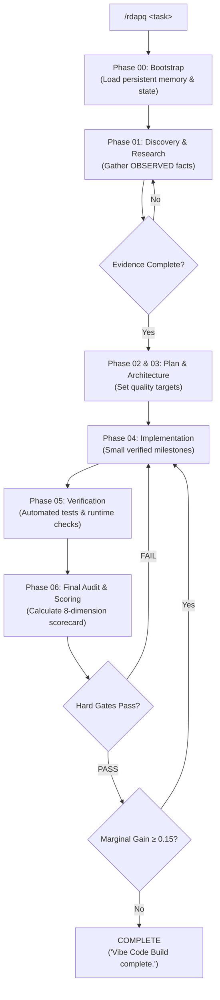

# RDAP-Q: Research-Driven Adaptive Planning with Quality Gates
### Universal Autonomous AI Agent Engineering Protocol & Marketplace Skill

[](https://www.gnu.org/licenses/gpl-3.0)
[](https://github.com/coldcanuk/rdapq)
[](https://github.com/coldcanuk/rdapq)
[](https://github.com/coldcanuk/rdapq/blob/main/marketplace.json)
[](#openai-codex)
[](#xai-grok)
[](#github-copilot)
[](#google-antigravity)
[](#block-goose)
[](#anthropic-claude--claude-code)
[](#cline--roo-code)

---

## 📌 Description

> **Short Description (SEO & Registries):**  
> **RDAP-Q: Research-Driven Adaptive Planning with Quality Gates** — Vendor-neutral AI agent engineering protocol & marketplace skill for **Codex, Grok, Copilot, Antigravity, Goose, Claude, and Cline**. Delivers evidence-first software engineering, calibrated quality scoring (0–10), persistent project state, and diminishing-return exit gates.

<!-- Machine-Readable Structured Metadata (Schema.org / JSON-LD for Crawlers & Robots) -->
```json
{
  "@context": "https://schema.org",
  "@type": "SoftwareSourceCode",
  "name": "RDAP-Q",
  "alternateName": "Research-Driven Adaptive Planning with Quality Gates",
  "version": "1.1.0",
  "description": "Universal AI agent engineering protocol for evidence-first software development, calibrated scoring, and diminishing-return exit gates across OpenAI Codex, xAI Grok, GitHub Copilot, Google Antigravity, Block Goose, Anthropic Claude, and Cline.",
  "codeRepository": "https://github.com/coldcanuk/rdapq",
  "license": "https://www.gnu.org/licenses/gpl-3.0",
  "programmingLanguage": ["Markdown", "Shell", "PowerShell", "JSON"],
  "applicationCategory": "DeveloperApplication",
  "operatingSystem": "Linux, macOS, Windows",
  "keywords": "ai-agent, agent-skills, openai-codex, xai-grok, github-copilot, google-antigravity, block-goose, anthropic-claude, claude-code, cline, roo-code, quality-gates, adaptive-planning, software-engineering, autonomous-agent, sdlc-automation, slash-command, evidence-first, calibrated-scoring"
}
```

---

## 🚀 Overview

**RDAP-Q** (Research-Driven Adaptive Planning with Quality Gates) is an open, vendor-neutral engineering methodology designed for autonomous coding agents, LLMs, and AI coding harnesses.

Standard AI assistants often suffer from hallucinated dependencies, ungrounded assumptions, premature completion declarations, and infinite optimization loops. RDAP-Q replaces guesswork with a disciplined, evidence-backed loop:

$$\text{Evidence} \longrightarrow \text{Correctness} \longrightarrow \text{Measured Quality} \longrightarrow \text{Worthwhile Improvement} \longrightarrow \text{Deterministic Stop}$$

### Why Autonomous Agents Need RDAP-Q

| Pain Point in Typical Agents | How RDAP-Q Solves It |
| :--- | :--- |
| **Hallucinated Implementation Facts** | **Fact Tracking**: Enforces strict categorization (`OBSERVED`, `USER_SPECIFIED`, `VERIFIED_EXTERNAL`, `INFERRED`, `UNKNOWN`). Decisions cannot rely on `INFERRED` facts when verification is possible. |
| **Premature "Task Complete" Claims** | **Hard Quality Gates**: Objective gate failures (failing tests, broken integrations, unverified behavior) categorically override numerical scores. |
| **Vague Quality Metrics** | **Calibrated 8-Dimension Scoring**: Evaluates Functional Correctness (25%), Requirements Coverage (15%), Verification Strength (15%), and more on an anchored 0–10 scale. |
| **Context Window Amnesia** | **Dual Persistence Model**: Separates ephemeral repository state (`.rdapq/state/`) from durable, secret-free cross-session memory (`$RDAPQ_HOME/memory/`). |
| **Runaway Agent Costs** | **Diminishing-Return Exit Logic**: Mathematically halts iterations when marginal quality improvement drops below threshold ($< 0.15$), saving tokens and compute. |
| **Vendor Lock-in** | **Universal Harness Support**: Native plug-and-play configuration for **Codex, Grok, Copilot, Antigravity, Goose, Claude, and Cline**. |

---

## 🧭 System Architecture & Control Loop



---

## 📦 Marketplace & Multi-Harness Installation

RDAP-Q supports three installation paths:
1. **[Harness Marketplace via GitHub URL](#1--marketplace-install-via-github-url)** (Direct import in Codex, Claude, Grok, Copilot, Antigravity, Goose, Cline)
2. **[NPM / NPX](#2--install-via-npm--npx)** (Zero-install execution or global package manager)
3. **[Universal Install Scripts](#3--universal-install-scripts)** (Shell & PowerShell)

### Supported AI Harnesses at a Glance

| AI Harness | Marketplace Method (GitHub URL) | NPM / CLI Setup | Primary Config | Slash Command |
| :--- | :--- | :--- | :--- | :--- |
| **[OpenAI Codex](#openai-codex)** | `codex skill add https://github.com/coldcanuk/rdapq` | `npx rdapq --codex` | `AGENTS.md` | `/rdapq <task>` |
| **[Anthropic Claude](#anthropic-claude--claude-code)** | `claude plugin add https://github.com/coldcanuk/rdapq` | `npx rdapq --claude` | `CLAUDE.md` | `/rdapq <task>` |
| **[xAI Grok](#xai-grok)** | `grok skill install https://github.com/coldcanuk/rdapq` | `npx rdapq --grok` | `.grok/rules.md` | `/rdapq <task>` |
| **[GitHub Copilot](#github-copilot)** | `gh extension install coldcanuk/rdapq` | `npx rdapq --copilot` | `.github/copilot-instructions.md` | `/rdapq <task>` |
| **[Google Antigravity](#google-antigravity)** | `agy skill add https://github.com/coldcanuk/rdapq` | `npx rdapq --antigravity` | `GEMINI.md` | `/rdapq <task>` |
| **[Block Goose](#block-goose)** | `goose toolkit add https://github.com/coldcanuk/rdapq` | `npx rdapq --goose` | `.goosehints` | `goose run` / `/rdapq` |
| **[Cline & Roo Code](#cline--roo-code)** | `npx -y @smithery/cli install coldcanuk/rdapq` | `npx rdapq --cline` | `.clinerules` | `/rdapq <task>` |

---

### 1. 🛒 Marketplace Install via GitHub URL

Point your AI harness or marketplace directly to the repository URL:
```text
https://github.com/coldcanuk/rdapq
```

Each harness automatically reads its native manifest and bridge:

- **Anthropic Claude Code:**
  ```bash
  # Claude Code marketplace plugin import:
  claude plugin add https://github.com/coldcanuk/rdapq
  # Or install slash command into ~/.claude/commands:
  npx rdapq --claude
  ```
  *(Claude Code auto-discovers `.claude-plugin/plugin.json`, `CLAUDE.md`, and `.claude/commands/rdapq.md`)*

- **OpenAI Codex & Agents:**
  ```bash
  # Import into Codex / Agent skills registry:
  codex skill add https://github.com/coldcanuk/rdapq
  ```
  *(Codex reads `AGENTS.md`, `skills.json`, and `.codex/skill.json`)*

- **xAI Grok:**
  ```bash
  # Register in Grok developer workspace:
  grok skill install https://github.com/coldcanuk/rdapq
  ```
  *(Grok reads `.grok/skill.json`, `.grok/rules.md`, and `manifest.json`)*

- **GitHub Copilot:**
  ```bash
  # GitHub CLI extension or Copilot agent import:
  gh extension install coldcanuk/rdapq
  ```
  *(Copilot reads `.github/copilot-instructions.md`)*

- **Google Antigravity:**
  ```bash
  # Antigravity skill / plugin import:
  agy skill add https://github.com/coldcanuk/rdapq
  # Or as a plugin bundle:
  agy plugin install https://github.com/coldcanuk/rdapq
  ```
  *(Antigravity reads `plugin.json`, `GEMINI.md`, and `.agents/skills/rdap-q/`)*

- **Block Goose:**
  ```bash
  # Install directly into Goose toolkit catalog:
  goose toolkit add https://github.com/coldcanuk/rdapq
  ```
  *(Goose reads `.goosehints` and `manifest.json`)*

- **Cline & Roo Code:**
  ```bash
  # Install via Smithery / Open VSX agent marketplace:
  npx -y @smithery/cli install coldcanuk/rdapq
  ```
  *(Cline reads `.clinerules` and `.roomodes`)*

---

### 2. ⚡ Install via NPM / NPX

RDAP-Q is available as an npm package and runnable via `npx` with zero installation required:

#### Instant Setup (All 7 Harnesses):
```bash
# Automatically detects and configures all 7 AI harnesses:
npx rdapq install --all
```

#### Initialize Current Project / Workspace:
```bash
# Drops AGENTS.md, CLAUDE.md, GEMINI.md, .clinerules, .goosehints, etc. into current directory:
npx rdapq init

# Or target a specific workspace:
npx rdapq --repo /path/to/my-project
```

#### Check Installation Status:
```bash
npx rdapq status
```

#### Install Globally via NPM:
```bash
npm install -g rdap-q

# Use the rdapq command anywhere:
rdapq status
rdapq init
rdapq install --claude --copilot --cline
```

#### Add as a Project Dev Dependency:
```bash
npm install --save-dev rdap-q
```

---

### 3. 📜 Universal Install Scripts

#### Linux / macOS / WSL:
```bash
# One-line fetch and install:
curl -fsSL https://raw.githubusercontent.com/coldcanuk/rdapq/main/install.sh | bash

# Or clone and run with flags:
git clone https://github.com/coldcanuk/rdapq.git
cd rdapq
./install.sh --all
```

#### Windows (PowerShell):
```powershell
# Clone and install for all harnesses:
git clone https://github.com/coldcanuk/rdapq.git
cd rdapq
.\install.ps1 -All
```

---

### Harness-Specific Setup Guides

#### OpenAI Codex
Codex and OpenAI Agents automatically ingest `AGENTS.md` at workspace root.
1. **Marketplace URL:** Point Codex to `https://github.com/coldcanuk/rdapq`
2. **NPM / CLI:**
   ```bash
   npx rdapq --codex
   ```
3. **Usage:** In Codex CLI or chat, invoke:
   ```text
   /rdapq Refactor user authentication with JWT validation
   ```

#### xAI Grok
Grok workspace agents inspect `.grok/rules.md` and root agent manifests.
1. **Marketplace URL:** Point Grok to `https://github.com/coldcanuk/rdapq`
2. **NPM / CLI:**
   ```bash
   npx rdapq --grok
   ```
3. **Usage:**
   ```text
   /rdapq Implement rate-limiting middleware with Redis
   ```

#### GitHub Copilot
GitHub Copilot Workspace, Copilot Chat in VS Code, and Copilot CLI use repository instructions:
1. **Marketplace URL:** Point Copilot to `https://github.com/coldcanuk/rdapq`
2. **NPM / CLI:**
   ```bash
   npx rdapq --copilot
   ```
3. **Usage:** In VS Code Copilot Chat or Copilot Workspace:
   ```text
   @workspace /rdapq Migrate SQLite database schema to PostgreSQL
   ```

#### Google Antigravity
Google Antigravity natively loads skills through `SKILL.md` frontmatter, `plugin.json`, and `GEMINI.md`:
1. **Marketplace URL:**
   ```bash
   agy skill add https://github.com/coldcanuk/rdapq
   ```
2. **NPM / CLI:**
   ```bash
   npx rdapq --antigravity
   ```
3. **Usage:** In Antigravity terminal / chat:
   ```text
   /rdapq Audit cryptographic key management and add rotation tests
   ```

#### Block Goose
Goose loads toolkits and hints:
1. **Marketplace URL:**
   ```bash
   goose toolkit add https://github.com/coldcanuk/rdapq
   ```
2. **NPM / CLI:**
   ```bash
   npx rdapq --goose
   ```
3. **Usage:**
   ```text
   goose run "/rdapq Fix memory leak in WebSocket stream handler"
   ```

#### Anthropic Claude / Claude Code
Claude Code natively supports project instructions via `CLAUDE.md` and custom slash commands:
1. **Marketplace URL:**
   ```bash
   claude plugin add https://github.com/coldcanuk/rdapq
   ```
2. **NPM / CLI:**
   ```bash
   npx rdapq --claude
   ```
3. **Usage:** In Claude Code:
   ```text
   /rdapq Implement distributed tracing with OpenTelemetry
   ```

#### Cline & Roo Code
Cline and Roo Code inspect `.clinerules` in the active workspace:
1. **Marketplace URL:**
   ```bash
   npx -y @smithery/cli install coldcanuk/rdapq
   ```
2. **NPM / CLI:**
   ```bash
   npx rdapq --cline
   # Or configure repo:
   npx rdapq init
   ```
3. **Usage:** In Cline chat:
   ```text
   /rdapq Build GraphQL schema validation with automated tests
   ```

---

## ⚡ Canonical Commands

Every harness adheres to the standardized `/rdapq` command suite:

| Command | Action / Semantic Meaning |
| :--- | :--- |
| `/rdapq <task>` | Execute task using RDAP-Q protocol: load memory, gather evidence, plan, execute adaptive quality loop, and stop cleanly. |
| `/rdapq status` | Show current lifecycle phase, scorecard, confidence levels, active gates, blockers, and iteration history. |
| `/rdapq score` | Calculate or display the current evidence-weighted 8-dimension scorecard. |
| `/rdapq audit` | Run the adversarial final-audit verification checklist. |
| `/rdapq resume` | Reload persistent memory/state, check for file/git drift, and safely resume. |
| `/rdapq memory` | Query active persistent memories, lessons, patterns, and constraints. |
| `/rdapq research`| Trigger structured discovery and evidence collection before planning. |
| `/rdapq explain` | Output transparent rationale for the current quality score or state transition. |

---

## 🎯 Calibrated Quality Scale (0–10)

RDAP-Q rejects arbitrary scores. All scores must be backed by verifiable evidence:

| Score | Calibration | Meaning & Criteria |
| :---: | :--- | :--- |
| **0** | Absent | Non-existent implementation; missing required components. |
| **1–2**| Fundamentally Broken | Severe runtime crashes, syntax errors, or critical security vulnerabilities. |
| **3–4**| Materially Deficient | Significant known defects, missing core requirements, or non-functional logic. |
| **5** | Plausible Unverified | Appears correct on inspection, but lacks empirical verification or unit tests. |
| **6** | Functional with Gaps | Executes successfully, but lacks edge case handling or thorough coverage. |
| **7** | Solid | Standard acceptable quality; passes automated test suite with clean architecture. |
| **8** | Strong Production | **Standard target.** Verified with comprehensive tests, failure handling, and documentation. |
| **9** | Exceptional | Very low residual uncertainty; exhaustive edge case testing, fuzzing, and benchmarking. |
| **10**| Reference Quality | Benchmark gold standard; mathematically proven or reference implementation. Rare. |

> [!NOTE]
> `8.x` is an excellent, production-ready stopping point. Do not burn unnecessary tokens chasing a theoretical 10.0 when marginal value has saturated.

### Default Implementation Dimensions

```
Functional Correctness        [25%] █████████████████████████
Requirements Coverage         [15%] ███████████████
Verification Strength         [15%] ███████████████
Integration & Compatibility   [10%] ██████████
Security & Failure Handling   [10%] ██████████
Maintainability               [10%] ██████████
Architectural Fit              [8%] ████████
Operability & Documentation    [7%] ███████
```

### Evidence Caps & Hard Gates

- **Unverified Behavior:** Dimension score capped at $\le 5.0$.
- **Inferred Implementation Dependency:** Dimension score capped at $\le 5.0$.
- **Known Material Defect:** Dimension score capped at $\le 4.0$.
- **Failing Required Test:** Hard Gate **`FAIL`** (Overrides numerical score).
- **Unexercised Integration:** Hard Gate **`FAIL`**.

---

## 💾 Storage & Persistence Model

RDAP-Q strictly decouples working project state from reusable cross-project memory:

```
├── Global Memory ($RDAPQ_HOME/ or ~/.rdapq/)
│   ├── config.md                 # Global environment & harness settings
│   ├── memory/                   # Durable cross-project lessons & patterns
│   │   ├── engineering-preferences.md
│   │   ├── tooling.md
│   │   ├── lessons.md
│   │   ├── patterns.md
│   │   └── constraints.md
│   ├── projects/                 # Cross-session project architecture records
│   ├── registry/                 # Tool & harness capability registry
│   └── skills/                   # Installed agent skills
│
└── Repository State (<repo>/.rdapq/state/)
    ├── scope.md                  # Task boundary & success criteria
    ├── assumptions.md            # Tracked assumptions & validation status
    ├── evidence.md               # Empirical observations (test runs, inspects)
    ├── research.md               # Discovery findings & API contracts
    ├── plan.md                   # Milestone roadmap & phase checklist
    ├── scorecard.md              # Current calibrated 8-dimension scores
    ├── risks.md                  # Identified risks & mitigations
    ├── decisions.md              # Architectural Decision Records (ADRs)
    └── iteration-log.md          # Round-by-round quality deltas
```

### Strict Memory Safety Rules
1. **Never Persist Secrets:** No API keys, passwords, bearer tokens, private keys, or credentials may ever be saved to memory or state. Store secret references (e.g. `Secret source: pass | identifier: api/key`), never raw values.
2. **Evidence Overrides Memory:** Fresh observations in the current repository always take precedence over historical memories.

---

## 🛑 Exit Criteria & Diminishing Returns

Agents using RDAP-Q stop automatically according to clear mathematical criteria:

- **CONTINUE / ITERATE**:
  - Any resolvable hard gate is failing.
  - An in-scope `HIGH` or `CRITICAL` defect remains.
  - Expected weighted quality improvement is $\ge 0.20$.
- **DIMINISHING RETURNS (Stop Work)**:
  - All completion gates pass, AND:
  - The last two completed rounds each yielded $< 0.15$ improvement; OR
  - Best remaining credible improvement is $< 0.20$ with no material risk remaining.
- **TERMINAL SUCCESS**:
  - The agent declares: **`Vibe Code Build complete.`**

---

## 🧩 Directory Structure

```text
rdapq/
├── .gitignore                    # Complete exclusions for state, caches, secrets
├── AGENTS.md                     # OpenAI Codex & Universal Agent Bridge
├── CLAUDE.md                     # Anthropic Claude Code Workspace Bridge
├── GEMINI.md                     # Google Antigravity & Gemini Bridge
├── LICENSE                       # GNU General Public License v3.0
├── README.md                     # High-density technical documentation
├── marketplace.json              # Agent Skills Marketplace catalog entry
├── package.json                  # NPM / VS Code registry metadata & keywords
├── manifest.json                 # RDAP-Q protocol entrypoint definition
├── install.sh                    # Multi-harness Unix installer
├── install.ps1                   # Multi-harness Windows PowerShell installer
├── .clinerules                   # Cline & Roo Code custom rules
├── .goosehints                   # Block Goose agent hints
├── .claude/
│   └── commands/rdapq.md         # Claude Code /rdapq slash command
├── .github/
│   └── copilot-instructions.md   # GitHub Copilot workspace instructions
├── .grok/
│   └── rules.md                  # xAI Grok developer rules
└── rdap-q-skill/                 # Core protocol package
    ├── SKILL.md                  # Primary protocol specification
    ├── manifest.json             # Protocol manifest
    ├── core/                     # Governance, scoring, gates, exit logic
    ├── playbooks/                # Deterministic phase playbooks (00–07)
    ├── state/                    # State templates
    ├── memory/                   # Durable memory templates
    ├── templates/                # Task & milestone templates
    └── diagrams/                 # Mermaid architecture diagrams
```

---

## ❓ Frequently Asked Questions (FAQ)

<details>
<summary><strong>How does RDAP-Q differ from standard system prompts?</strong></summary>
Standard system prompts are static and easily forgotten as the agent's context fills up. RDAP-Q is an active, deterministic protocol that uses phased playbook loading, persistent file-based state (<code>.rdapq/state/</code>), evidence caps, and rigorous mathematical exit gates.
</details>

<details>
<summary><strong>Can I use RDAP-Q in existing CI/CD pipelines?</strong></summary>
Yes. Because state and scorecards are saved as standard Markdown files in <code>.rdapq/state/</code>, CI/CD runners can verify gate compliance, inspect scorecards, or audit the evidence log before approving pull requests.
</details>

<details>
<summary><strong>Does RDAP-Q slow down small tasks?</strong></summary>
No. RDAP-Q scales adaptively. For simple bug fixes or localized edits, the agent moves rapidly through Bootstrap and Discovery, runs verification, confirms a passing score (&ge; 7.2 for low risk), and terminates in a single round.
</details>

<details>
<summary><strong>How do I override the default storage directory?</strong></summary>
Set the <code>RDAPQ_HOME</code> environment variable:
<pre><code>export RDAPQ_HOME=/custom/path/.rdapq</code></pre>
This is particularly useful in containerized environments, sandboxed CI jobs, and bubblewrap runtimes.
</details>

---

## 📄 License

This project is licensed under the **GNU General Public License v3.0** (GPL-3.0-or-later). See [LICENSE](LICENSE) for full details.

---

## 🤝 Contributing & Community

Contributions are welcome! If you want to add support for a new AI harness, optimize scoring rubrics, or improve phase playbooks:

1. Fork the repository: [https://github.com/coldcanuk/rdapq](https://github.com/coldcanuk/rdapq)
2. Create a feature branch: `git checkout -b feature/new-harness-support`
3. Verify your changes pass verification with `/rdapq audit`
4. Submit a Pull Request.

**Maintained by:** [@coldcanuk](https://github.com/coldcanuk)  
**Issues & Discussions:** [https://github.com/coldcanuk/rdapq/issues](https://github.com/coldcanuk/rdapq/issues)
