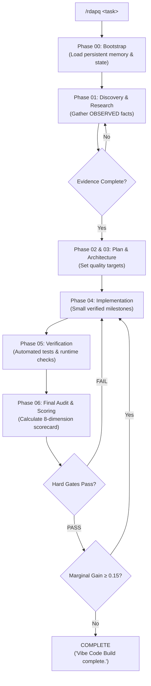

# RDAP-Q: Research-Driven Adaptive Planning with Quality Gates
### Universal Autonomous AI Agent Engineering Protocol & Marketplace Skill

[](https://github.com/coldcanuk/rdapq/actions/workflows/ci.yml)
[](https://www.gnu.org/licenses/gpl-3.0)
[](https://github.com/coldcanuk/rdapq)
[](https://github.com/coldcanuk/rdapq)
[](https://github.com/coldcanuk/rdapq/blob/main/marketplace.json)
[](#openai-codex)
[](#xai-grok)
[](#github-copilot)
[](#google-antigravity)
[](#block-goose)
[](#anthropic-claude--claude-code)
[](#cline--roo-code)

---

## <a id="description"></a> 📌 Description

> **Short Description (SEO & Registries):**  
> **RDAP-Q: Research-Driven Adaptive Planning with Quality Gates** — Vendor-neutral AI agent engineering protocol & marketplace skill for **Codex, Grok, Copilot, Antigravity, Goose, Claude, and Cline**. Delivers evidence-first software engineering, calibrated quality scoring (0–10), persistent project state, and diminishing-return exit gates.

<!-- Machine-Readable Structured Metadata (Schema.org / JSON-LD for Crawlers & Robots) -->
```json
{
  "@context": "https://schema.org",
  "@type": "SoftwareSourceCode",
  "name": "RDAP-Q",
  "alternateName": "Research-Driven Adaptive Planning with Quality Gates",
  "version": "1.2.0",
  "description": "Universal AI agent engineering protocol for evidence-first software development, calibrated scoring, and diminishing-return exit gates across OpenAI Codex, xAI Grok, GitHub Copilot, Google Antigravity, Block Goose, Anthropic Claude, and Cline.",
  "codeRepository": "https://github.com/coldcanuk/rdapq",
  "license": "https://www.gnu.org/licenses/gpl-3.0",
  "programmingLanguage": ["JavaScript", "YAML", "Markdown", "Shell", "PowerShell", "JSON"],
  "applicationCategory": "DeveloperApplication",
  "operatingSystem": "Linux, macOS, Windows",
  "keywords": "ai-agent, agent-skills, openai-codex, xai-grok, github-copilot, google-antigravity, block-goose, anthropic-claude, claude-code, cline, roo-code, quality-gates, adaptive-planning, software-engineering, autonomous-agent, sdlc-automation, slash-command, evidence-first, calibrated-scoring"
}
```

---

## <a id="overview"></a> 🚀 Overview

**RDAP-Q** (Research-Driven Adaptive Planning with Quality Gates) is an open, vendor-neutral engineering methodology designed for autonomous coding agents, LLMs, and AI coding harnesses.

Standard AI assistants often suffer from hallucinated dependencies, ungrounded assumptions, premature completion declarations, and infinite optimization loops. RDAP-Q replaces guesswork with a disciplined, evidence-backed loop:

$$\text{Evidence} \longrightarrow \text{Correctness} \longrightarrow \text{Measured Quality} \longrightarrow \text{Worthwhile Improvement} \longrightarrow \text{Deterministic Stop}$$

### Why Autonomous Agents Need RDAP-Q

| Pain Point in Typical Agents | How RDAP-Q Solves It |
| :--- | :--- |
| **Hallucinated Implementation Facts** | **Fact Tracking**: Enforces strict categorization (`OBSERVED`, `USER_SPECIFIED`, `VERIFIED_EXTERNAL`, `INFERRED`, `UNKNOWN`). Decisions cannot rely on `INFERRED` facts when verification is possible. |
| **Premature "Task Complete" Claims** | **Hard Quality Gates**: Objective gate failures (failing tests, broken integrations, unverified behavior) categorically override numerical scores. |
| **Vague Quality Metrics** | **Calibrated 8-Dimension Scoring**: Evaluates Functional Correctness (25%), Requirements Coverage (15%), Verification Strength (15%), and more on an anchored 0–10 scale. |
| **Context Window Amnesia** | **Dual Persistence Model**: Separates ephemeral repository state (`.rdapq/state/`) from durable, secret-free cross-session memory (`$RDAPQ_HOME/memory/`). |
| **Runaway Agent Costs** | **Diminishing-Return Exit Logic**: Mathematically halts iterations when marginal quality improvement drops below threshold ($< 0.15$), saving tokens and compute. |
| **Vendor Lock-in** | **Universal Harness Support**: Native plug-and-play configuration for **Codex, Grok, Copilot, Antigravity, Goose, Claude, and Cline**. |

---

## <a id="table-of-contents"></a> 📑 Table of Contents

- [📌 Description](#description)
- [🚀 Overview](#overview)
- [🧭 System Architecture & Control Loop](#system-architecture)
- [📦 In-Harness Marketplace Installation (Recommended)](#in-harness-marketplace-installation)
  - [xAI Grok (TUI Menu GUI & CLI)](#xai-grok-marketplace)
  - [Anthropic Claude Code (TUI Menu GUI & CLI)](#anthropic-claude-marketplace)
  - [Google Antigravity (Skills Palette & CLI)](#google-antigravity-marketplace)
  - [OpenAI Codex & Agents](#openai-codex-marketplace)
  - [Block Goose](#block-goose-marketplace)
  - [GitHub Copilot](#github-copilot-marketplace)
  - [Cline & Roo Code](#cline--roo-code-marketplace)
- [⚡ Install](#npm-npx-installation)
- [📜 Local clone](#universal-install-scripts)
- [🔄 Update](#update)
- [⚡ Canonical Commands (`/rdapq`)](#canonical-commands)
- [🎯 Calibrated Quality Scale (0–10)](#calibrated-quality-scale)
  - [Default Implementation Dimensions](#default-implementation-dimensions)
  - [Evidence Caps & Hard Gates](#evidence-caps--hard-gates)
- [💾 Storage & Persistence Model](#storage-and-persistence-model)
  - [Strict Memory Safety Rules](#strict-memory-safety-rules)
- [🛑 Exit Criteria & Diminishing Returns](#exit-criteria)
- [🧩 Directory Structure](#directory-structure)
- [❓ Frequently Asked Questions (FAQ)](#faq)
- [📄 License](#license)
- [🤝 Contributing & Community](#contributing)

---

## <a id="system-architecture"></a> 🧭 System Architecture & Control Loop

The host model is the control plane. RDAP-Q does not run a server. `bin/rdapq.js` is the only installer implementation; `install.sh` and `install.ps1` refuse a piped launch and then exec that CLI. Personal harness files are created when missing and are not replaced unless you pass `--force` (the previous file is kept as `*.rdapq-backup`). Skill trees are staged and renamed into place, so a failed copy cannot delete a working install.


```mermaid
flowchart TD
    A["/rdapq &lt;task&gt;"] --> B["Phase 00: Bootstrap<br/>(Load persistent memory &amp; state)"]
    B --> C["Phase 01: Discovery &amp; Research<br/>(Gather OBSERVED facts)"]
    C --> D{"Evidence Complete?"}
    D -- No --> C
    D -- Yes --> E["Phase 02 &amp; 03: Plan &amp; Architecture<br/>(Set quality targets)"]
    E --> F["Phase 04: Implementation<br/>(Small verified milestones)"]
    F --> G["Phase 05: Verification<br/>(Automated tests &amp; runtime checks)"]
    G --> H["Phase 06: Final Audit &amp; Scoring<br/>(Calculate 8-dimension scorecard)"]
    H --> I{"Hard Gates Pass?"}
    I -- FAIL --> F
    I -- PASS --> J{"Marginal Gain &ge; 0.15?"}
    J -- Yes --> F
    J -- No --> K["COMPLETE<br/>('Vibe Code Build complete.')"]
```

---

## <a id="in-harness-marketplace-installation"></a> 📦 In-Harness Marketplace Installation (Recommended)

RDAP-Q is packaged natively as a marketplace plugin across major AI coding harnesses. You can install it directly inside your harness via its **text-based TUI menu** (e.g. `/skills` or `/plugins`), or via the harness CLI by pointing to the GitHub marketplace repository `coldcanuk/rdapq`.

### Supported AI Harnesses at a Glance

| AI Harness | In-Harness TUI Menu GUI | CLI Marketplace Command | Primary Config | Invocation |
| :--- | :--- | :--- | :--- | :--- |
| **[xAI Grok](#xai-grok-marketplace)** | `/skills` or `/plugins` → Marketplace | `grok plugin marketplace add coldcanuk/rdapq` | `.grok/rules.md` | `/rdapq <task>` |
| **[Anthropic Claude Code](#anthropic-claude-marketplace)** | `/plugins` → Marketplace | `claude plugin marketplace add coldcanuk/rdapq` | `CLAUDE.md` | `/rdapq <task>` |
| **[Google Antigravity](#google-antigravity-marketplace)** | `/skills` menu palette | `agy plugin marketplace add coldcanuk/rdapq` | `GEMINI.md` | `/rdapq <task>` |
| **[OpenAI Codex](#openai-codex-marketplace)** | `/skills` → Marketplace | `codex skill add https://github.com/coldcanuk/rdapq` | `AGENTS.md` | `/rdapq <task>` |
| **[Block Goose](#block-goose-marketplace)** | Interactive Toolkit Selector | `goose toolkit add coldcanuk/rdapq` | `.goosehints` | `goose run` / `/rdapq` |
| **[GitHub Copilot](#github-copilot-marketplace)** | VS Code Extensions Market | `gh extension install coldcanuk/rdapq` | `.github/copilot-instructions.md` | `/rdapq <task>` |
| **[Cline & Roo Code](#cline--roo-code-marketplace)** | Modes & Rules GUI | `npx --yes github:coldcanuk/rdapq install --cline` | `.clinerules` | `/rdapq <task>` |

---

### <a id="xai-grok"></a><a id="xai-grok-marketplace"></a> 🤖 xAI Grok (TUI Menu GUI & CLI)

#### Step 1: Add marketplace and install plugin
```bash
grok plugin marketplace add coldcanuk/rdapq
grok plugin install rdap-q --trust
```

#### Step 2: Enable the plugin
```bash
grok plugin enable rdap-q
```

#### Step 3: Or install via the in-harness Text-Based Menu GUI (TUI):
1. In your Grok session, type `/skills` or `/plugins` to open the text-based interactive menu.
2. Use arrow keys or `Tab` to navigate to the **Marketplace** / **Plugins** tab.
3. Select **rdap-q**.
4. Press `Space` to enable/install.
5. Press `r` to reload (or start a new session).

#### One-shot install from plugin path:
```bash
grok plugin install coldcanuk/rdapq#plugins/rdap-q --trust
```

#### Local clone:
```bash
git clone https://github.com/coldcanuk/rdapq.git
grok plugin marketplace add ./rdapq
grok plugin install rdap-q --trust
```

#### How to use in Grok:
- Slash command: `/rdapq <task>`
- The installed bridge loads `rdap-q-skill/SKILL.md` only when you invoke `/rdapq`. It does not turn the protocol on for every engineering task.

---

### <a id="anthropic-claude--claude-code"></a><a id="anthropic-claude-marketplace"></a> 🎭 Anthropic Claude Code (TUI Menu GUI & CLI)

#### CLI Install:
```bash
claude plugin marketplace add coldcanuk/rdapq
claude plugin install rdap-q
```

#### In-Harness TUI Menu:
1. In Claude Code, run `/plugins` or `/skills` to display the interactive plugins menu.
2. Select **Marketplace** and choose **rdap-q**.
3. Hit `Enter` to install and enable.
4. Run `/rdapq <task>` in your project.

---

### <a id="google-antigravity"></a><a id="google-antigravity-marketplace"></a> 🛸 Google Antigravity (Skills Palette & CLI)

#### CLI Install:
```bash
# Register marketplace repository and install plugin:
agy plugin marketplace add coldcanuk/rdapq
agy plugin install rdap-q

# Or install skill directly:
agy skill add https://github.com/coldcanuk/rdapq
```

#### In-Harness Skills Palette:
1. Open Antigravity and type `/skills`.
2. Browse installed or discovered workspace skills.
3. Select **rdap-q** to activate the engineering protocol.

---

### <a id="openai-codex"></a><a id="openai-codex-marketplace"></a> 🧠 OpenAI Codex & Agents

#### CLI Install:
```bash
codex skill add https://github.com/coldcanuk/rdapq
```

#### In-Harness GUI:
1. Open Codex / ChatGPT Developer Assistant.
2. Open `/skills` or the Agent Skills catalog.
3. Search for **RDAP-Q** (or paste repository URL `https://github.com/coldcanuk/rdapq`).
4. Toggle on **rdap-q** to enable evidence-first quality gating.

---

### <a id="block-goose"></a><a id="block-goose-marketplace"></a> 🪿 Block Goose

#### CLI Install:
```bash
goose toolkit add coldcanuk/rdapq
```

#### Interactive Session:
1. Run `goose session`.
2. Inspect toolkits via the session prompt.
3. Invoke `/rdapq <task>` or `goose run "/rdapq <task>"`.

---

### <a id="github-copilot"></a><a id="github-copilot-marketplace"></a> 🐙 GitHub Copilot

#### CLI / Extension Install:
```bash
gh extension install coldcanuk/rdapq
```

#### VS Code In-App Marketplace:
1. Press `Ctrl+Shift+X` (or `Cmd+Shift+X` on macOS) in VS Code.
2. Search for Copilot Extension: **RDAP-Q**.
3. In Copilot Chat, use `@workspace /rdapq <task>`.

---

### <a id="cline--roo-code"></a><a id="cline--roo-code-marketplace"></a> 💻 Cline & Roo Code

#### First-party install:
```bash
npx --yes github:coldcanuk/rdapq install --cline
```

#### Optional third-party installer:
```bash
# Smithery can auto-approve a remote install. Prefer the first-party command above.
npx -y @smithery/cli install coldcanuk/rdapq
```

#### In-App Settings GUI:
1. Open the Cline panel in VS Code.
2. Click on **Settings** (⚙️) → **Prompts / Rules**.
3. Import from URL: `https://github.com/coldcanuk/rdapq`.
4. In chat, type `/rdapq <task>`.

---

## <a id="npm-npx-installation"></a> ⚡ Install

Node.js 18 or newer is required. Do not pipe the installer (`curl | bash`, `irm | iex`). A piped script cannot see the skill tree and is refused.

`rdap-q` is not on the npm registry yet. Use a checkout or the GitHub package. After a Trusted Publisher release, `npx rdap-q` will be the same CLI.

`SKILL.md` is the instruction source the agent loads. This README is the human guide.

With no harness flag, `install` configures all seven. Name a harness to leave the others alone. `init` and `install` are separate commands. Do not pass harness flags to `init`.

Edited harness files are kept. Pass `--force` to replace one. The previous file is saved as `<file>.rdapq-backup`. A file that is kept also gets the new copy beside it as `<file>.rdapq`. Skill trees are copied to a staging directory and renamed into place only after `SKILL.md` is present, so a failed update does not delete a working install.

### One harness, or several:
```bash
# Core skill plus Claude only.
npx --yes github:coldcanuk/rdapq install --claude

# Codex and Grok together:
npx --yes github:coldcanuk/rdapq install --codex --grok

# Pin the 1.2.0 tag instead of the default branch:
npx --yes github:coldcanuk/rdapq#v1.2.0 install --claude
```

### All 7 harnesses:
```bash
npx --yes github:coldcanuk/rdapq install --all
```

### This repository only, no harness files:
```bash
npx --yes github:coldcanuk/rdapq install --global-only
```

That writes `$RDAPQ_HOME` (default `~/.rdapq`): `skills/rdap-q/`, plus empty `memory/`, `projects/`, and `registry/` directories. It does not create harness bridges.

### Initialize the current project:
```bash
# Missing bridges and .rdapq/state. Does not clobber a file you already edited.
npx --yes github:coldcanuk/rdapq init

# Replace existing bridges, keeping backups:
npx --yes github:coldcanuk/rdapq init --force

# Or target a specific workspace:
npx --yes github:coldcanuk/rdapq --repo /path/to/my-project
```

`init` writes `AGENTS.md`, `CLAUDE.md`, `GEMINI.md`, `.clinerules`, `.goosehints`, `.grok/rules.md`, `.github/copilot-instructions.md`, `.claude/commands/rdapq.md`, and the skill tree at `.agents/skills/rdap-q/`.

### Check installation status:
```bash
npx --yes github:coldcanuk/rdapq status
```

### Install the command globally:
```bash
npm install -g github:coldcanuk/rdapq
rdapq install --claude
rdapq status
rdapq init
```

Harness homes can be redirected without touching the real user profile. `RDAPQ_HOME`, `GEMINI_HOME`, `GOOSE_HOME`, `CLAUDE_HOME`, `CLINE_HOME`, `CODEX_HOME`, `GROK_HOME`, and `COPILOT_HOME` are all honored.

---

## <a id="universal-install-scripts"></a> 📜 Local clone

Do not pipe the installer from the network. A piped script cannot see this repository and is refused on purpose.

### Linux / macOS / WSL:
```bash
git clone https://github.com/coldcanuk/rdapq.git
cd rdapq
./install.sh --all          # every harness
./install.sh --claude       # one harness
npm test                    # installer, packaging, and version checks
```

### Windows (PowerShell):
```powershell
git clone https://github.com/coldcanuk/rdapq.git
cd rdapq
.\install.ps1 -All
.\install.ps1 -Claude -Force
```

`install.sh` and `install.ps1` are wrappers around `node bin/rdapq.js`. With no harness flag they install all seven. `.\install.ps1` has no `status` switch. Use `node .\bin\rdapq.js status`.

---

## <a id="update"></a> 🔄 Update

There is no `update` command. Install again with the same flags. A newer skill tree is staged and swapped in only after its `SKILL.md` verifies. The previous tree is removed only after that rename. If the copy fails, the previous tree is put back.

These are not inside the skill tree and are kept:

- `$RDAPQ_HOME/memory/`
- `$RDAPQ_HOME/projects/`
- repository task state in `<repo>/.rdapq/state/`
- a harness file you have edited, unless you pass `--force`

### Checkout you already have
```bash
cd rdapq
git fetch origin --tags
git checkout v1.2.0          # or: git pull origin main
./install.sh --claude        # same flags as the first install
./install.sh status
```

```powershell
cd rdapq
git fetch origin --tags
git checkout v1.2.0
.\install.ps1 -Claude
node .\bin\rdapq.js status
```

### Global npm install from GitHub
```bash
npm install -g github:coldcanuk/rdapq
rdapq install --claude
rdapq status
```

Pin a tag with `npm install -g github:coldcanuk/rdapq#v1.2.0`. Re-run that install to move later. Then run `rdapq install` again so the files on disk match the new package. `npm install -g` alone does not refresh `~/.rdapq` or the harness files.

### Take the new harness text
A re-install that sees a different `AGENTS.md`, `CLAUDE.md`, or other bridge leaves your file in place and writes the packaged copy next to it as `<file>.rdapq`. Diff that sidecar. When you want the packaged text:

```bash
./install.sh --claude --force
```

`--force` copies the current file to `<file>.rdapq-backup`, then writes the new one. It does not delete `$RDAPQ_HOME/memory`.

### Workspace already initialized
```bash
./install.sh init
```

That refreshes `.agents/skills/rdap-q/` and creates any bridge that is missing. Add `--force` only when you want the bridges replaced. Start a new harness session afterward so it does not keep the previous `SKILL.md` in context.

---

## <a id="canonical-commands"></a> ⚡ Canonical Commands

Every harness adheres to the standardized `/rdapq` command suite:

| Command | Action / Semantic Meaning |
| :--- | :--- |
| `/rdapq <task>` | Execute task using RDAP-Q protocol: load memory, gather evidence, plan, execute adaptive quality loop, and stop cleanly. |
| `/rdapq status` | Show current lifecycle phase, scorecard, confidence levels, active gates, blockers, and iteration history. |
| `/rdapq score` | Calculate or display the current evidence-weighted 8-dimension scorecard. |
| `/rdapq audit` | Run the adversarial final-audit verification checklist. |
| `/rdapq resume` | Reload persistent memory/state, check for file/git drift, and safely resume. |
| `/rdapq memory` | Query active persistent memories, lessons, patterns, and constraints. |
| `/rdapq research`| Trigger structured discovery and evidence collection before planning. |
| `/rdapq explain` | Output transparent rationale for the current quality score or state transition. |

---

## <a id="calibrated-quality-scale"></a> 🎯 Calibrated Quality Scale (0–10)

RDAP-Q rejects arbitrary scores. All scores must be backed by verifiable evidence:

| Score | Calibration | Meaning & Criteria |
| :---: | :--- | :--- |
| **0** | Absent | Non-existent implementation; missing required components. |
| **1–2**| Fundamentally Broken | Severe runtime crashes, syntax errors, or critical security vulnerabilities. |
| **3–4**| Materially Deficient | Significant known defects, missing core requirements, or non-functional logic. |
| **5** | Plausible Unverified | Appears correct on inspection, but lacks empirical verification or unit tests. |
| **6** | Functional with Gaps | Executes successfully, but lacks edge case handling or thorough coverage. |
| **7** | Solid | Standard acceptable quality; passes automated test suite with clean architecture. |
| **8** | Strong Production | **Standard target.** Verified with comprehensive tests, failure handling, and documentation. |
| **9** | Exceptional | Very low residual uncertainty; exhaustive edge case testing, fuzzing, and benchmarking. |
| **10**| Reference Quality | Benchmark gold standard; mathematically proven or reference implementation. Rare. |

> [!NOTE]
> `8.x` is an excellent, production-ready stopping point. Do not burn unnecessary tokens chasing a theoretical 10.0 when marginal value has saturated.

### <a id="default-implementation-dimensions"></a> Default Implementation Dimensions

```
Functional Correctness        [25%] █████████████████████████
Requirements Coverage         [15%] ███████████████
Verification Strength         [15%] ███████████████
Integration & Compatibility   [10%] ██████████
Security & Failure Handling   [10%] ██████████
Maintainability               [10%] ██████████
Architectural Fit              [8%] ████████
Operability & Documentation    [7%] ███████
```

### <a id="evidence-caps--hard-gates"></a> Evidence Caps & Hard Gates

- **Unverified Behavior:** Dimension score capped at $\le 5.0$.
- **Inferred Implementation Dependency:** Dimension score capped at $\le 5.0$.
- **Known Material Defect:** Dimension score capped at $\le 4.0$.
- **Failing Required Test:** Hard Gate **`FAIL`** (Overrides numerical score).
- **Unexercised Integration:** Hard Gate **`FAIL`**.

---

## <a id="storage-and-persistence-model"></a> 💾 Storage & Persistence Model

RDAP-Q strictly decouples working project state from reusable cross-project memory:

```
├── Global Memory ($RDAPQ_HOME/ or ~/.rdapq/)
│   ├── config.md                 # Global environment & harness settings
│   ├── memory/                   # Durable cross-project lessons & patterns
│   │   ├── engineering-preferences.md
│   │   ├── tooling.md
│   │   ├── lessons.md
│   │   ├── patterns.md
│   │   └── constraints.md
│   ├── projects/                 # Cross-session project architecture records
│   ├── registry/                 # Tool & harness capability registry
│   └── skills/                   # Installed agent skills
│
└── Repository State (<repo>/.rdapq/state/)
    ├── scope.md                  # Task boundary & success criteria
    ├── assumptions.md            # Tracked assumptions & validation status
    ├── evidence.md               # Empirical observations (test runs, inspects)
    ├── research.md               # Discovery findings & API contracts
    ├── plan.md                   # Milestone roadmap & phase checklist
    ├── scorecard.md              # Current calibrated 8-dimension scores
    ├── risks.md                  # Identified risks & mitigations
    ├── decisions.md              # Architectural Decision Records (ADRs)
    └── iteration-log.md          # Round-by-round quality deltas
```

### <a id="strict-memory-safety-rules"></a> Strict Memory Safety Rules
1. **Never Persist Secrets:** No API keys, passwords, bearer tokens, private keys, or credentials may ever be saved to memory or state. Store secret references (e.g. `Secret source: pass | identifier: api/key`), never raw values.
2. **Evidence Overrides Memory:** Fresh observations in the current repository always take precedence over historical memories.

---

## <a id="exit-criteria"></a> 🛑 Exit Criteria & Diminishing Returns

Agents using RDAP-Q stop automatically according to clear mathematical criteria:

- **CONTINUE / ITERATE**:
  - Any resolvable hard gate is failing.
  - An in-scope `HIGH` or `CRITICAL` defect remains.
  - Expected weighted quality improvement is $\ge 0.20$.
- **DIMINISHING RETURNS (Stop Work)**:
  - All completion gates pass, AND:
  - The last two completed rounds each yielded $< 0.15$ improvement; OR
  - Best remaining credible improvement is $< 0.20$ with no material risk remaining.
- **TERMINAL SUCCESS**:
  - The agent declares: **`Vibe Code Build complete.`**

---

## <a id="directory-structure"></a> 🧩 Directory Structure

```text
rdapq/
├── .gitignore                    # Complete exclusions for state, caches, secrets
├── AGENTS.md                     # OpenAI Codex & Universal Agent Bridge
├── CLAUDE.md                     # Anthropic Claude Code Workspace Bridge
├── GEMINI.md                     # Google Antigravity & Gemini Bridge
├── LICENSE                       # GNU General Public License v3.0
├── README.md                     # High-density technical documentation
├── marketplace.json              # Agent Skills Marketplace catalog entry
├── package.json                  # NPM / VS Code registry metadata & keywords
├── manifest.json                 # RDAP-Q protocol entrypoint definition
├── install.sh                    # Thin Unix wrapper around bin/rdapq.js
├── install.ps1                   # Thin Windows wrapper around bin/rdapq.js
├── bin/rdapq.js                  # CLI entrypoint
├── lib/installer.js              # Installer implementation
├── test/                         # node:test coverage for install/init/status/pack
├── scripts/                      # Version, static, and npm pack checks
├── .clinerules                   # Cline & Roo Code custom rules
├── .goosehints                   # Block Goose agent hints
├── .claude-plugin/               # Claude Code marketplace definition
├── .grok-plugin/                 # xAI Grok marketplace definition
├── plugins/                      # Grok / Antigravity plugin catalog
├── .claude/
│   └── commands/rdapq.md         # Claude Code /rdapq slash command
├── .github/
│   └── copilot-instructions.md   # GitHub Copilot workspace instructions
├── .grok/
│   └── rules.md                  # xAI Grok developer rules
└── rdap-q-skill/                 # Core protocol package
    ├── SKILL.md                  # Primary protocol specification
    ├── manifest.json             # Protocol manifest
    ├── core/                     # Governance, scoring, gates, exit logic
    ├── playbooks/                # Deterministic phase playbooks (00–07)
    ├── state/                    # State templates
    ├── memory/                   # Durable memory templates
    ├── templates/                # Task & milestone templates
    └── diagrams/                 # Mermaid architecture diagrams
```

---

## <a id="faq"></a> ❓ Frequently Asked Questions (FAQ)

<details>
<summary><strong>How does RDAP-Q differ from standard system prompts?</strong></summary>
Standard system prompts are static and easily forgotten as the agent's context fills up. RDAP-Q is an active, deterministic protocol that uses phased playbook loading, persistent file-based state (<code>.rdapq/state/</code>), evidence caps, and rigorous mathematical exit gates.
</details>

<details>
<summary><strong>Can I use RDAP-Q in existing CI/CD pipelines?</strong></summary>
Yes. Because state and scorecards are saved as YAML in <code>.rdapq/state/</code> (the files keep a <code>.md</code> name), CI/CD runners can verify gate compliance, inspect scorecards, or audit the evidence log before approving pull requests.
</details>

<details>
<summary><strong>Does RDAP-Q slow down small tasks?</strong></summary>
No. RDAP-Q scales adaptively. For simple bug fixes or localized edits, the agent moves rapidly through Bootstrap and Discovery, runs verification, confirms a passing score (&ge; 7.2 for low risk), and terminates in a single round.
</details>

<details>
<summary><strong>How do I override the default storage directory?</strong></summary>
Set the <code>RDAPQ_HOME</code> environment variable:
<pre><code>export RDAPQ_HOME=/custom/path/.rdapq</code></pre>
Per-harness homes use <code>CODEX_HOME</code>, <code>GROK_HOME</code>, <code>COPILOT_HOME</code>, <code>CLAUDE_HOME</code>, <code>CLINE_HOME</code>, <code>GEMINI_HOME</code>, and <code>GOOSE_HOME</code>.
This is particularly useful in containerized environments, sandboxed CI jobs, and bubblewrap runtimes.
</details>

---

## <a id="license"></a> 📄 License

This project is licensed under the **GNU General Public License v3.0** (GPL-3.0-or-later). See [LICENSE](LICENSE) for full details.

---

## <a id="contributing"></a> 🤝 Contributing & Community

Contributions are welcome! If you want to add support for a new AI harness, optimize scoring rubrics, or improve phase playbooks:

1. Fork the repository: [https://github.com/coldcanuk/rdapq](https://github.com/coldcanuk/rdapq)
2. Create a feature branch: `git checkout -b feature/new-harness-support`
3. Run `npm test` (Node.js 18+). It checks installer behavior, the npm tarball, and version consistency.
4. Tag a release `vX.Y.Z` only after the version in `package.json` matches every manifest. Publishing runs in `.github/workflows/release.yml` once the `NPM_PUBLISH` repository variable is `true` and npm Trusted Publisher is configured for this repo.
5. Submit a Pull Request.

**Maintained by:** [@coldcanuk](https://github.com/coldcanuk)  
**Issues & Discussions:** [https://github.com/coldcanuk/rdapq/issues](https://github.com/coldcanuk/rdapq/issues)
