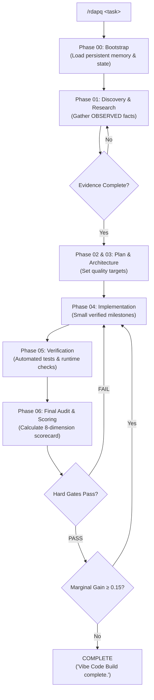

# RDAP-Q: Research-Driven Adaptive Planning with Quality Gates
### Universal Autonomous AI Agent Engineering Protocol & Marketplace Skill

[](https://github.com/coldcanuk/rdapq/actions/workflows/ci.yml)
[](https://www.gnu.org/licenses/gpl-3.0)
[](https://github.com/coldcanuk/rdapq)
[](https://github.com/coldcanuk/rdapq)
[](https://github.com/coldcanuk/rdapq/blob/main/marketplace.json)
[](#in-harness-marketplace-installation)
[](#in-harness-marketplace-installation)
[](#in-harness-marketplace-installation)
[](#in-harness-marketplace-installation)
[](#in-harness-marketplace-installation)
[](#in-harness-marketplace-installation)
[](#in-harness-marketplace-installation)
[](#in-harness-marketplace-installation)

---

## <a id="description"></a> 📌 Description

> **Short Description (SEO & Registries):**  
> **RDAP-Q: Research-Driven Adaptive Planning with Quality Gates** — Vendor-neutral AI agent engineering protocol & marketplace skill for **Codex, Grok, Copilot, Antigravity, Goose, Claude, Cline, and Cursor**. Delivers evidence-first software engineering, calibrated quality scoring (0–10), persistent project state, and diminishing-return exit gates.

<!-- Machine-Readable Structured Metadata (Schema.org / JSON-LD for Crawlers & Robots) -->
```json
{
  "@context": "https://schema.org",
  "@type": "SoftwareSourceCode",
  "name": "RDAP-Q",
  "alternateName": "Research-Driven Adaptive Planning with Quality Gates",
  "version": "1.3.1",
  "description": "Universal AI agent engineering protocol for evidence-first software development, calibrated scoring, and diminishing-return exit gates across OpenAI Codex, xAI Grok, GitHub Copilot, Google Antigravity, Block Goose, Anthropic Claude, Cline, and Cursor.",
  "codeRepository": "https://github.com/coldcanuk/rdapq",
  "license": "https://www.gnu.org/licenses/gpl-3.0",
  "programmingLanguage": ["JavaScript", "YAML", "Markdown", "Shell", "PowerShell", "JSON"],
  "applicationCategory": "DeveloperApplication",
  "operatingSystem": "Linux, macOS, Windows",
  "keywords": "ai-agent, agent-skills, openai-codex, xai-grok, github-copilot, google-antigravity, block-goose, anthropic-claude, claude-code, cline, roo-code, cursor, quality-gates, adaptive-planning, software-engineering, autonomous-agent, sdlc-automation, slash-command, evidence-first, calibrated-scoring"
}
```

---

## <a id="overview"></a> 🚀 Overview

**RDAP-Q** (Research-Driven Adaptive Planning with Quality Gates) is an open, vendor-neutral engineering methodology designed for autonomous coding agents, LLMs, and AI coding harnesses.

Standard AI assistants often suffer from hallucinated dependencies, ungrounded assumptions, premature completion declarations, and infinite optimization loops. RDAP-Q replaces guesswork with a disciplined, evidence-backed loop:

$$\text{Evidence} \longrightarrow \text{Correctness} \longrightarrow \text{Measured Quality} \longrightarrow \text{Worthwhile Improvement} \longrightarrow \text{Deterministic Stop}$$

### Why Autonomous Agents Need RDAP-Q

| Pain Point in Typical Agents | How RDAP-Q Solves It |
| :--- | :--- |
| **Hallucinated Implementation Facts** | **Fact Tracking**: Enforces strict categorization (`OBSERVED`, `USER_SPECIFIED`, `VERIFIED_EXTERNAL`, `INFERRED`, `UNKNOWN`). Decisions cannot rely on `INFERRED` facts when verification is possible. |
| **Premature "Task Complete" Claims** | **Hard Quality Gates**: Objective gate failures (failing tests, broken integrations, unverified behavior) categorically override numerical scores. |
| **Vague Quality Metrics** | **Calibrated 8-Dimension Scoring**: Evaluates Functional Correctness (25%), Requirements Coverage (15%), Verification Strength (15%), and more on an anchored 0–10 scale. |
| **Context Window Amnesia** | **Dual Persistence Model**: Separates ephemeral repository state (`.rdapq/state/`) from durable, secret-free cross-session memory (`$RDAPQ_HOME/memory/`). |
| **Runaway Agent Costs** | **Diminishing-Return Exit Logic**: Mathematically halts iterations when marginal quality improvement drops below threshold ($< 0.15$), saving tokens and compute. |
| **Vendor Lock-in** | **Universal Harness Support**: Native plug-and-play configuration for **Codex, Grok, Copilot, Antigravity, Goose, Claude, Cline, and Cursor**. |

---

## <a id="table-of-contents"></a> 📑 Table of Contents

- [📌 Description](#description)
- [🚀 Overview](#overview)
- [🧭 System Architecture & Control Loop](#system-architecture)
- [📦 Harness install](#in-harness-marketplace-installation)
- [⚡ Install](#npm-npx-installation)
- [📜 Local clone](#universal-install-scripts)
- [🔄 Update](#update)
- [🔁 Weekly harness audit](#harness-audit)
- [⚡ Canonical Commands (`/rdapq`)](#canonical-commands)
- [🎯 Calibrated Quality Scale (0–10)](#calibrated-quality-scale)
  - [Default Implementation Dimensions](#default-implementation-dimensions)
  - [Evidence Caps & Hard Gates](#evidence-caps--hard-gates)
- [💾 Storage & Persistence Model](#storage-and-persistence-model)
  - [Strict Memory Safety Rules](#strict-memory-safety-rules)
- [🛑 Exit Criteria & Diminishing Returns](#exit-criteria)
- [📊 Eval](#eval)
- [🧩 Directory Structure](#directory-structure)
- [❓ Frequently Asked Questions (FAQ)](#faq)
- [📄 License](#license)
- [🤝 Contributing & Community](#contributing)

---

## <a id="system-architecture"></a> 🧭 System Architecture & Control Loop

The host model is the control plane. RDAP-Q does not run a server. `bin/rdapq.js` is the only installer implementation; `install.sh` and `install.ps1` refuse a piped launch and then exec that CLI. Personal harness files are created when missing and are not replaced unless you pass `--force` (the previous file is kept as `*.rdapq-backup`). Skill trees are staged and renamed into place, so a failed copy cannot delete a working install.


```mermaid
flowchart TD
    A["/rdapq &lt;task&gt;"] --> B["Phase 00: Bootstrap<br/>(Load persistent memory &amp; state)"]
    B --> C["Phase 01: Discovery &amp; Research<br/>(Gather OBSERVED facts)"]
    C --> D{"Evidence Complete?"}
    D -- No --> C
    D -- Yes --> E["Phase 02 &amp; 03: Plan &amp; Architecture<br/>(Set quality targets)"]
    E --> F["Phase 04: Implementation<br/>(Small verified milestones)"]
    F --> G["Phase 05: Verification<br/>(Automated tests &amp; runtime checks)"]
    G --> H["Phase 06: Final Audit &amp; Scoring<br/>(Calculate 8-dimension scorecard)"]
    H --> I{"Hard Gates Pass?"}
    I -- FAIL --> F
    I -- PASS --> J{"Marginal Gain &ge; 0.15?"}
    J -- Yes --> F
    J -- No --> K["COMPLETE<br/>('Vibe Code Build complete.')"]
```

---

## <a id="in-harness-marketplace-installation"></a> 📦 Harness install

This package is not in the Anthropic, xAI, or GitHub Copilot catalogs. Do not use `gh extension install`, a VS Code extension search, or `goose toolkit add`. Those commands do not install RDAP-Q.

The supported install is `npx --yes rdap-q`. `install --<harness>` writes that harness's user files. `init` writes the project files. A harness slash command is `/rdap-q` when the client loads `SKILL.md`. `/rdapq` works where a project bridge or Claude command file is present.

| Harness | User install | What it writes | Project install (`init`) | Invoke |
| :--- | :--- | :--- | :--- | :--- |
| **Cursor** | `--cursor` | `~/.cursor/skills/rdap-q/` | `AGENTS.md`, `.agents/skills/rdap-q/` | `/rdap-q`, or `/rdapq` after `init` |
| **Codex** | `--codex` | `~/.agents/skills/rdap-q/` | `AGENTS.md`, `.agents/skills/rdap-q/` | `/rdap-q` |
| **Claude Code** | `--claude` | `~/.claude/skills/rdap-q/`, `~/.claude/commands/rdapq.md` | `CLAUDE.md`, `.claude/skills/rdap-q/`, `.claude/commands/rdapq.md` | `/rdap-q` or `/rdapq` |
| **Copilot** | `--copilot` | `~/.copilot/skills/rdap-q/` | `.github/copilot-instructions.md`, `.agents/skills/rdap-q/` | `/rdap-q` where skills load; project instructions are always on after `init` |
| **Grok Build** | `--grok` | `~/.grok/skills/rdap-q/` | `.grok/rules.md` | `/rdap-q` |
| **Antigravity** | `--antigravity` | `~/.gemini/antigravity-cli/skills/rdap-q/`, `~/.gemini/config/skills/rdap-q/` | `GEMINI.md`, `AGENTS.md`, `.agents/skills/rdap-q/` | `/rdap-q` |
| **Goose** | `--goose` | `~/.config/goose/.goosehints` | `.goosehints` | no slash command; hints load when the Developer extension is on |
| **Cline** | `--cline` | `~/.cline/rules/rdapq.md` | `.clinerules/rdapq.md` | rules load with the workspace; there is no marketplace entry |

`CURSOR_HOME`, `CLAUDE_HOME`, `COPILOT_HOME`, `GROK_HOME`, `GEMINI_HOME`, `GOOSE_HOME`, `CLINE_HOME`, and `AGENTS_HOME` override those directories.

User installs never add always-on global rules for harnesses that load skills on demand, so RDAP-Q stays out of sessions that do not invoke it. Global bridges (the Claude command, Cline rules, Goose hints) point at the installed core under `$RDAPQ_HOME`. Earlier releases wrote `~/.codex/AGENTS.md` and `~/.copilot/copilot-instructions.md`; the installer never deletes your files, so remove those by hand if they only contain the RDAP-Q bridge.

```bash
npx --yes rdap-q install --cursor
npx --yes rdap-q install --codex --claude
npx --yes rdap-q init
```

Claude Code can also add this repository as a plugin marketplace from inside a session, because `.claude-plugin/marketplace.json` is in the repo:

```text
/plugin marketplace add coldcanuk/rdapq
/plugin install rdap-q@rdapq
```

That is optional. It is not required for `install --claude` or `init`.

---

## <a id="npm-npx-installation"></a> ⚡ Install

Node.js 22 or newer is required. Install from [`rdap-q`](https://www.npmjs.com/package/rdap-q) on the public npm registry. This tree is package version **1.3.1**. Do not pipe an installer from the network (`curl | bash`, `irm | iex`). A piped script cannot see the skill tree and is refused.

`SKILL.md` is the instruction source the agent loads. This README is the human guide.

With no harness flag, `install` configures all eight. Name a harness to leave the others alone. `init` and `install` are separate commands. Do not pass harness flags to `init`.

Edited harness files are kept. Pass `--force` to replace one. The previous file is saved as `<file>.rdapq-backup`. A file that is kept also gets the new copy beside it as `<file>.rdapq`. Skill trees are copied to a staging directory and renamed into place only after `SKILL.md` is present, so a failed update does not delete a working install.

### One harness, or several:
```bash
# Core skill plus Claude only.
npx --yes rdap-q install --claude

# Cursor only. The skill lands in ~/.cursor/skills/rdap-q.
npx --yes rdap-q install --cursor

# Codex and Grok together:
npx --yes rdap-q install --codex --grok

# This release, not whatever is tagged latest later:
npx --yes rdap-q@1.3.1 install --claude
```

### All 8 harnesses:
```bash
npx --yes rdap-q install --all
```

### This repository only, no harness files:
```bash
npx --yes rdap-q install --global-only
```

That writes `$RDAPQ_HOME` (default `~/.rdapq`): `skills/rdap-q/`, plus empty `memory/`, `projects/`, and `registry/` directories. It does not create harness bridges.

### Initialize the current project:
```bash
# Missing bridges and .rdapq/state. Does not clobber a file you already edited.
npx --yes rdap-q init

# Replace existing bridges, keeping backups:
npx --yes rdap-q init --force

# Or target a specific workspace:
npx --yes rdap-q --repo /path/to/my-project
```

`init` writes `AGENTS.md`, `CLAUDE.md`, `GEMINI.md`, `.clinerules/rdapq.md`, `.goosehints`, `.grok/rules.md`, `.github/copilot-instructions.md`, `.claude/commands/rdapq.md`, and skill trees at `.agents/skills/rdap-q/` and `.claude/skills/rdap-q/`. Cursor, Codex, Copilot, and Antigravity read `.agents/skills`. Claude Code reads `.claude/skills`.

### Check installation status:
```bash
npx --yes rdap-q status
```

### Install the command globally:
```bash
npm install -g rdap-q
rdapq install --claude
rdapq status
rdapq init
```

Harness homes can be redirected without touching the real user profile. `RDAPQ_HOME`, `GEMINI_HOME`, `GOOSE_HOME`, `CLAUDE_HOME`, `CLINE_HOME`, `GROK_HOME`, `COPILOT_HOME`, `CURSOR_HOME`, and `AGENTS_HOME` are all honored.

A checkout of a branch that is not released yet can still be installed with `npx --yes github:coldcanuk/rdapq`. The registry package is the supported install.

---

## <a id="universal-install-scripts"></a> 📜 Local clone

Do not pipe the installer from the network. A piped script cannot see this repository and is refused on purpose.

### Linux / macOS / WSL:
```bash
git clone https://github.com/coldcanuk/rdapq.git
cd rdapq
./install.sh --all          # every harness
./install.sh --claude       # one harness
./install.sh --cursor       # Cursor skill only
npm test                    # installer, packaging, and version checks
```

### Windows (PowerShell):
```powershell
git clone https://github.com/coldcanuk/rdapq.git
cd rdapq
.\install.ps1 -All
.\install.ps1 -Claude -Force
```

`install.sh` and `install.ps1` are wrappers around `node bin/rdapq.js`. With no harness flag they install all eight. `.\install.ps1` has no `status` switch. Use `node .\bin\rdapq.js status`.

---

## <a id="update"></a> 🔄 Update

There is no `update` command. Install the same flags again. A newer skill tree is staged and swapped in only after its `SKILL.md` verifies. The previous tree is removed only after that rename. If the copy fails, the previous tree is put back.

These are not inside the skill tree and are kept:

- `$RDAPQ_HOME/memory/`
- `$RDAPQ_HOME/projects/`
- repository task state in `<repo>/.rdapq/state/`
- a harness file you have edited, unless you pass `--force`

`npm install` updates the CLI package only. It does not refresh `~/.rdapq` or the harness files. Run `rdapq install` again after the package is newer.

### Registry (normal path)
```bash
npx --yes rdap-q@latest install --cursor
npx --yes rdap-q@latest status
```

Use the same harness flags you used the first time. `--cursor` above is only an example. To stay on this release:

```bash
npx --yes rdap-q@1.3.1 install --cursor
```

### Command installed globally
```bash
npm install -g rdap-q@latest
rdapq install --cursor
rdapq status
```

### Checkout you already have
```bash
cd rdapq
git fetch origin --tags
git checkout v1.3.1          # or: git pull origin main
./install.sh --claude        # same flags as the first install
./install.sh status
```

```powershell
cd rdapq
git fetch origin --tags
git checkout v1.3.1
.\install.ps1 -Claude
node .\bin\rdapq.js status
```

### Take the new harness text
A re-install that sees a different `AGENTS.md`, `CLAUDE.md`, or other bridge leaves your file in place and writes the packaged copy next to it as `<file>.rdapq`. Diff that sidecar. When you want the packaged text:

```bash
npx --yes rdap-q install --claude --force
```

`--force` copies the current file to `<file>.rdapq-backup`, then writes the new one. It does not delete `$RDAPQ_HOME/memory`.

### Workspace already initialized
```bash
npx --yes rdap-q init
```

That refreshes `.agents/skills/rdap-q/` and creates any bridge that is missing. Add `--force` only when you want the bridges replaced. Start a new harness session afterward so it does not keep the previous `SKILL.md` in context.

---

## <a id="harness-audit"></a> 🔁 Weekly harness audit

Vendor docs move. `scripts/harness-audit/check.py` fetches each vendor `llms.txt`, then the skills and rules pages linked from it, and checks that the paths in `lib/installer.js` and this README are still on those pages. A passing run does not call a model. If a path disappears, it writes `reports/harness-audit/review-prompt.md` for a local model. That directory is gitignored.

```bash
python3 scripts/harness-audit/check.py --self-test
./scripts/harness-audit/weekly.sh
```

The weekly script is what you cron. It does not use Grok cloud credits. Set `RDAPQ_AUDIT_REVIEW` only if a failed run should be handed to a local model.

---

## <a id="canonical-commands"></a> ⚡ Canonical Commands

Every harness adheres to the standardized `/rdapq` command suite:

| Command | Action / Semantic Meaning |
| :--- | :--- |
| `/rdapq <task>` | Execute task using RDAP-Q protocol at the current depth: implement, verify with real commands, and stop cleanly within 3 rounds. |
| `/rdapq depth lean\|standard\|full` | Set how many phases run. `lean` (default): IMPLEMENT + VERIFY. `standard`: adds BOOTSTRAP + DISCOVERY. `full`: all phases. The user switch wins over the effort fallback. |
| `/rdapq status` | Show phase, depth, oracle Q, gates, blockers, and round. |
| `/rdapq score` | Show oracle Q. Writes the 8-dimension self-card only for this command, as a label that never enters Q or the exit. |
| `/rdapq audit` | Run the adversarial final-audit verification checklist. Loads AUDIT even at `lean`. |
| `/rdapq resume` | Reload persistent memory/state, check for file/git drift, and safely resume. |
| `/rdapq memory` | Query active persistent memories, lessons, patterns, and constraints. |
| `/rdapq research`| Trigger structured discovery and evidence collection. Implies `standard` or `full` for this task. |
| `/rdapq explain` | Explain the current depth, phase, or exit decision. |

---

## <a id="calibrated-quality-scale"></a> 🎯 Calibrated Quality Scale (0–10)

RDAP-Q rejects arbitrary scores. All scores must be backed by verifiable evidence:

| Score | Calibration | Meaning & Criteria |
| :---: | :--- | :--- |
| **0** | Absent | Non-existent implementation; missing required components. |
| **1–2**| Fundamentally Broken | Severe runtime crashes, syntax errors, or critical security vulnerabilities. |
| **3–4**| Materially Deficient | Significant known defects, missing core requirements, or non-functional logic. |
| **5** | Plausible Unverified | Appears correct on inspection, but lacks empirical verification or unit tests. |
| **6** | Functional with Gaps | Executes successfully, but lacks edge case handling or thorough coverage. |
| **7** | Solid | Standard acceptable quality; passes automated test suite with clean architecture. |
| **8** | Strong Production | **Standard target.** Verified with comprehensive tests, failure handling, and documentation. |
| **9** | Exceptional | Very low residual uncertainty; exhaustive edge case testing, fuzzing, and benchmarking. |
| **10**| Reference Quality | Benchmark gold standard; mathematically proven or reference implementation. Rare. |

> [!NOTE]
> This scale labels the optional 8-dimension self-card written by `/rdapq score`. Since 1.3.1 the self-card is annotation only: it never enters Q and never decides an exit.

### <a id="oracle-q"></a> Oracle Q

Q is computed only from oracles a tool can observe. Each oracle is `pass` (10), `partial` (5), `fail` (0), or not run (excluded):

| Oracle | Weight | Pass | Partial |
| :--- | :---: | :--- | :--- |
| runtime | 35 | Every required command exits 0, and at least one check touches the changed code. | Commands pass, but none touches the change. |
| repo | 25 | The diff touches exactly the stated files. | Extra files are only generated or lockfile output. |
| external | 15 | Every material external claim is `VERIFIED_EXTERNAL`. | The unverified claims are off the changed path. |
| claims | 15 | Scaled by verified / total material claims. | — |
| repro | 10 | The failure reproduced before the fix, and the same command passes after it. | Only one of the two was run. |

Two failures are "the same" when they share an oracle id: the command plus its first failing test id or assertion. The same failure twice ends the run as `STALLED`.

Q is the weighted mean of the oracles that ran. If none ran, Q is `UNMEASURED` and the task cannot be `COMPLETE`. Q is reported, but no Q number completes a task. Completion needs every applicable gate to pass and every oracle required for the task's risk to pass:

| Risk | Required oracles |
| :--- | :--- |
| LOW, MODERATE | runtime, repo |
| HIGH | runtime, repo, repro |
| CRITICAL | runtime, repo, repro, external |

`partial` never satisfies a requirement, and any oracle at `fail` blocks completion. `runtime` only passes when at least one executed check touches the changed code. A required oracle may be absent only when it does not apply: `repro` with no defect in scope, `external` with no external claim.

### <a id="default-implementation-dimensions"></a> Self-card Dimensions (annotation only)

```
Functional Correctness        [25%] █████████████████████████
Requirements Coverage         [15%] ███████████████
Verification Strength         [15%] ███████████████
Integration & Compatibility   [10%] ██████████
Security & Failure Handling   [10%] ██████████
Maintainability               [10%] ██████████
Architectural Fit              [8%] ████████
Operability & Documentation    [7%] ███████
```

### <a id="evidence-caps--hard-gates"></a> Evidence Caps & Hard Gates

- **Unverified Behavior:** Dimension score capped at $\le 5.0$.
- **Inferred Implementation Dependency:** Dimension score capped at $\le 5.0$.
- **Known Material Defect:** Dimension score capped at $\le 4.0$.
- **Failing Required Test:** Hard Gate **`FAIL`** (Overrides numerical score).
- **Unexercised Integration:** Hard Gate **`FAIL`**.

---

## <a id="storage-and-persistence-model"></a> 💾 Storage & Persistence Model

RDAP-Q strictly decouples working project state from reusable cross-project memory:

```
├── Global Memory ($RDAPQ_HOME/ or ~/.rdapq/)
│   ├── config.md                 # Global environment & harness settings
│   ├── memory/                   # Durable cross-project lessons & patterns
│   │   ├── engineering-preferences.md
│   │   ├── tooling.md
│   │   ├── lessons.md
│   │   ├── patterns.md
│   │   └── constraints.md
│   ├── projects/                 # Cross-session project architecture records
│   ├── registry/                 # Tool & harness capability registry
│   └── skills/                   # Installed agent skills
│
└── Repository State (<repo>/.rdapq/state/)
    ├── scope.md                  # Task boundary & success criteria
    ├── assumptions.md            # Tracked assumptions & validation status
    ├── evidence.md               # Empirical observations (test runs, inspects)
    ├── research.md               # Discovery findings & API contracts
    ├── plan.md                   # Milestone roadmap & phase checklist
    ├── scorecard.md              # Oracle Q rows; self-card only after /rdapq score
    ├── risks.md                  # Identified risks & mitigations
    ├── decisions.md              # Architectural Decision Records (ADRs)
    ├── iteration-log.md          # One row per round (max 3)
    └── depth.md                  # Present only after /rdapq depth
```

### <a id="strict-memory-safety-rules"></a> Strict Memory Safety Rules
1. **Never Persist Secrets:** No API keys, passwords, bearer tokens, private keys, or credentials may ever be saved to memory or state. Store secret references (e.g. `Secret source: pass | identifier: api/key`), never raw values.
2. **Evidence Overrides Memory:** Fresh observations in the current repository always take precedence over historical memories.

---

## <a id="exit-criteria"></a> 🛑 Exit Criteria & Round Cap

Agents using RDAP-Q stop within 3 rounds:

- **ITERATE** (only while rounds remain):
  - A gate failed with a new failing oracle, or
  - An in-scope `HIGH` or `CRITICAL` defect has a reproduction.
  - Self-score gaps, prose polish, and a repeated identical failure never justify another round.
- **STOP, NOT COMPLETE**:
  - The same oracle fails twice: `STALLED`.
  - Round cap with ambiguous success criteria: `UNCLEAR_TASK`.
  - Round cap with no verification command run: `MISSING_TEST`.
  - Also `BLOCKED`, `CONSTRAINT_LIMITED`, and `FAILED_VERIFICATION`.
- **TERMINAL SUCCESS** (all applicable gates pass and every required oracle passes):
  - The agent declares: **`Vibe Code Build complete.`**

---

## <a id="eval"></a> 📊 Eval

`eval/` measures whether RDAP-Q helps instead of asserting it. Eight small Node tasks (three bug fixes, two features, a refactor, and two traps whose visible tests pass on a naive fix) each ship hidden tests and a reference solution. `node eval/run.js --self-test` proves the hidden tests fail on the starting code and pass on the reference; `npm test` runs it.

```bash
node eval/run.js --agents claude:claude-sonnet-5-5,claude:claude-haiku-4-5-20251001 --conditions none,lean,full --reps 2
node eval/report.js eval/results/<run> --write
```

The headline number is the **false-DONE rate**: runs that ended with "STATUS: DONE" while the hidden tests fail. Agents run headless with a scoped tool allowlist (read, edit, `node`, `npm test`, `git`) and project settings only.

### Baseline: RDAP-Q 1.3.1 (2026-09-30)

Sonnet 5.5 and Haiku 4.5, 8 tasks × 2 repetitions, 32 runs per condition. Full report: [`eval/results/baseline-1.3.1/report.md`](eval/results/baseline-1.3.1/report.md).

| condition | hidden pass | false DONE | mean cost | mean turns |
| :--- | :---: | :---: | :---: | :---: |
| no protocol | 100% | 0% | $0.08 | 7.1 |
| RDAP-Q lean | 91% | 9% | $0.12 | 15.2 |
| RDAP-Q full | 97% | 3% | $0.15 | 17.6 |

On this set, 1.3.1 cost 1.5–1.9× more and did not improve outcomes; all four false DONEs came from RDAP-Q runs. `lean` runs usually never opened `SKILL.md`, and only 1 of 64 RDAP-Q runs reported a terminal state. The tasks are also too easy for an unassisted agent to fail, so this set can show cost but not yet benefit. Harder tasks are the next addition.

---

## <a id="directory-structure"></a> 🧩 Directory Structure

```text
rdapq/
├── .gitignore                    # Complete exclusions for state, caches, secrets
├── AGENTS.md                     # OpenAI Codex & Universal Agent Bridge
├── CLAUDE.md                     # Anthropic Claude Code Workspace Bridge
├── GEMINI.md                     # Google Antigravity & Gemini Bridge
├── LICENSE                       # GNU General Public License v3.0
├── README.md                     # High-density technical documentation
├── marketplace.json              # Agent Skills Marketplace catalog entry
├── package.json                  # NPM / VS Code registry metadata & keywords
├── manifest.json                 # RDAP-Q protocol entrypoint definition
├── install.sh                    # Thin Unix wrapper around bin/rdapq.js
├── install.ps1                   # Thin Windows wrapper around bin/rdapq.js
├── bin/rdapq.js                  # CLI entrypoint
├── lib/installer.js              # Installer implementation
├── test/                         # node:test coverage for install/init/status/pack
├── scripts/                      # Version, static, and npm pack checks
├── eval/                         # Hidden-test eval harness and published results
├── .clinerules/rdapq.md          # Cline workspace rule
├── .goosehints                   # Block Goose agent hints
├── .claude-plugin/               # Claude Code marketplace definition
├── .grok-plugin/                 # xAI Grok marketplace definition
├── plugins/                      # Grok / Antigravity plugin catalog
├── .claude/
│   └── commands/rdapq.md         # Claude Code /rdapq slash command
├── .github/
│   └── copilot-instructions.md   # GitHub Copilot workspace instructions
├── .grok/
│   └── rules.md                  # xAI Grok developer rules
└── rdap-q-skill/                 # Core protocol package
    ├── SKILL.md                  # Primary protocol specification
    ├── manifest.json             # Protocol manifest
    ├── core/                     # Governance, scoring, gates, exit logic
    ├── playbooks/                # Deterministic phase playbooks (00–07)
    ├── state/                    # State templates
    ├── memory/                   # Durable memory templates
    ├── templates/                # Task & milestone templates
    └── diagrams/                 # Mermaid architecture diagrams
```

---

## <a id="faq"></a> ❓ Frequently Asked Questions (FAQ)

<details>
<summary><strong>How does RDAP-Q differ from standard system prompts?</strong></summary>
Standard system prompts are static and easily forgotten as the agent's context fills up. RDAP-Q is an active, deterministic protocol that uses phased playbook loading, persistent file-based state (<code>.rdapq/state/</code>), evidence caps, and rigorous mathematical exit gates.
</details>

<details>
<summary><strong>Can I use RDAP-Q in existing CI/CD pipelines?</strong></summary>
Yes. Because state and scorecards are saved as YAML in <code>.rdapq/state/</code> (the files keep a <code>.md</code> name), CI/CD runners can verify gate compliance, inspect scorecards, or audit the evidence log before approving pull requests.
</details>

<details>
<summary><strong>Does RDAP-Q slow down small tasks?</strong></summary>
No. RDAP-Q scales adaptively. For simple bug fixes or localized edits, the agent moves rapidly through Bootstrap and Discovery, runs verification, confirms the required oracles pass (runtime and repo for low risk), and terminates in a single round.
</details>

<details>
<summary><strong>How do I override the default storage directory?</strong></summary>
Set the <code>RDAPQ_HOME</code> environment variable:
<pre><code>export RDAPQ_HOME=/custom/path/.rdapq</code></pre>
Per-harness homes use <code>AGENTS_HOME</code> (Codex), <code>GROK_HOME</code>, <code>COPILOT_HOME</code>, <code>CLAUDE_HOME</code>, <code>CLINE_HOME</code>, <code>GEMINI_HOME</code>, and <code>GOOSE_HOME</code>.
This is particularly useful in containerized environments, sandboxed CI jobs, and bubblewrap runtimes.
</details>

---

## <a id="license"></a> 📄 License

This project is licensed under the **GNU General Public License v3.0** (GPL-3.0-or-later). See [LICENSE](LICENSE) for full details.

---

## <a id="contributing"></a> 🤝 Contributing & Community

Contributions are welcome! If you want to add support for a new AI harness, optimize scoring rubrics, or improve phase playbooks:

1. Fork the repository: [https://github.com/coldcanuk/rdapq](https://github.com/coldcanuk/rdapq)
2. Create a feature branch: `git checkout -b feature/new-harness-support`
3. Run `npm test` (Node.js 22+). It checks installer behavior, the npm tarball, and version consistency.
4. To release, run `npm version <patch|minor|major>`. It stamps the version into every manifest and bridge (see `scripts/version-targets.js`) in the same commit and tags `vX.Y.Z`. Never edit version stamps by hand; `npm run stamp` repairs drift. Publishing runs in `.github/workflows/release.yml` once the `NPM_PUBLISH` repository variable is `true` and npm Trusted Publisher is configured for this repo.
5. Submit a Pull Request.

**Maintained by:** [@coldcanuk](https://github.com/coldcanuk)  
**Issues & Discussions:** [https://github.com/coldcanuk/rdapq/issues](https://github.com/coldcanuk/rdapq/issues)
