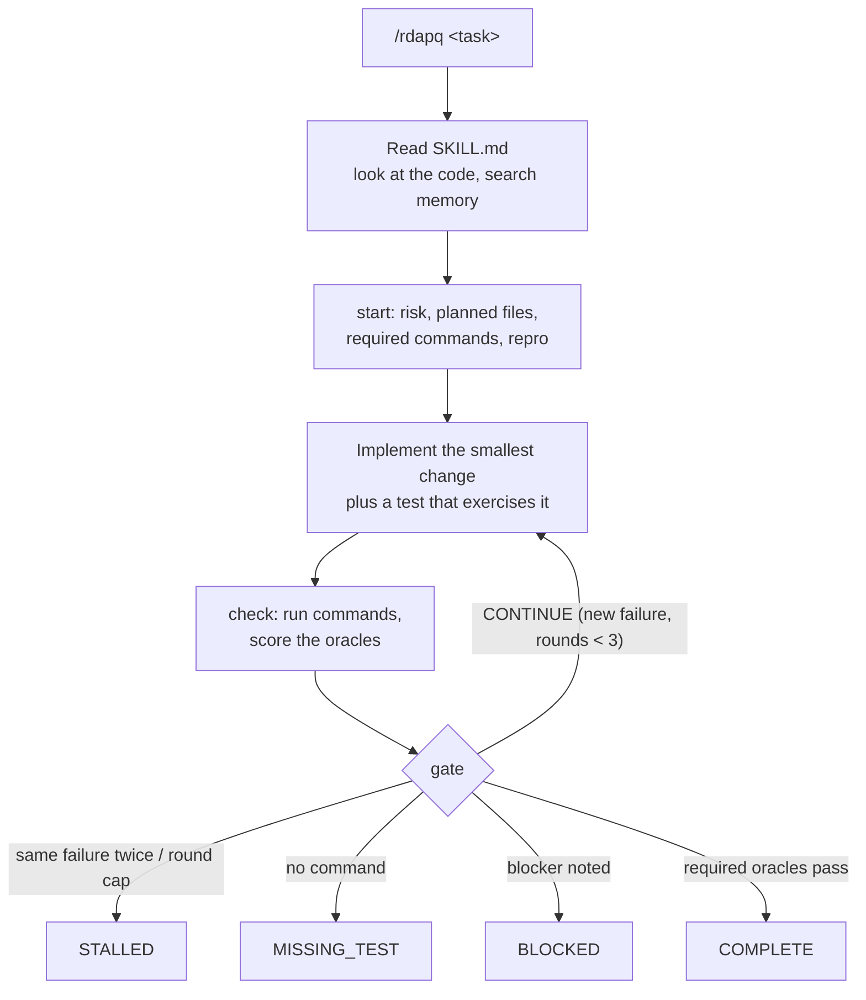

# RDAP-Q: Research-Driven Adaptive Planning with Quality Gates
### Universal Autonomous AI Agent Engineering Protocol & Marketplace Skill

[](https://github.com/coldcanuk/rdapq/actions/workflows/ci.yml)
[](https://www.gnu.org/licenses/gpl-3.0)
[](https://github.com/coldcanuk/rdapq)
[](https://github.com/coldcanuk/rdapq)
[](https://github.com/coldcanuk/rdapq/blob/main/marketplace.json)
[](#in-harness-marketplace-installation)
[](#in-harness-marketplace-installation)
[](#in-harness-marketplace-installation)
[](#in-harness-marketplace-installation)
[](#in-harness-marketplace-installation)
[](#in-harness-marketplace-installation)
[](#in-harness-marketplace-installation)
[](#in-harness-marketplace-installation)

---

## <a id="description"></a> 📌 Description

> **RDAP-Q: Research-Driven Adaptive Planning with Quality Gates** — an evidence-first protocol and skill for AI coding agents in **Codex, Grok, Copilot, Antigravity, Goose, Claude, Cline, and Cursor**. A bundled tool runs the checks and names the result, so the model never grades its own work.

<!-- Machine-Readable Structured Metadata (Schema.org / JSON-LD for Crawlers & Robots) -->
```json
{
  "@context": "https://schema.org",
  "@type": "SoftwareSourceCode",
  "name": "RDAP-Q",
  "alternateName": "Research-Driven Adaptive Planning with Quality Gates",
  "version": "2.0.0",
  "description": "Evidence-first engineering protocol for AI coding agents. A bundled tool runs the checks and names the result, so the model never grades its own work.",
  "codeRepository": "https://github.com/coldcanuk/rdapq",
  "license": "https://www.gnu.org/licenses/gpl-3.0",
  "programmingLanguage": ["JavaScript", "Markdown", "Shell", "PowerShell", "JSON"],
  "applicationCategory": "DeveloperApplication",
  "operatingSystem": "Linux, macOS, Windows",
  "keywords": "ai-agent, agent-skills, openai-codex, xai-grok, github-copilot, google-antigravity, block-goose, anthropic-claude, claude-code, cline, roo-code, cursor, quality-gates, evidence-first, autonomous-agent, slash-command"
}
```

---

## <a id="overview"></a> 🚀 Overview

Coding agents often say "done" when they are not. They grade their own work, and a self-grade is an opinion. RDAP-Q moves that decision into code: **the model proposes, the tool decides.**

The agent reads `SKILL.md` (about 1.2k tokens), plans the change, and then drives `tool/rdapq.js`, a zero-dependency Node script that ships inside the skill:

| Step | Command | What the tool does |
| :--- | :--- | :--- |
| Plan | `start --risk LOW --files a,b --run "npm test"` | Records what "done" means: risk, planned files, required commands, optional repro. |
| Prove the bug | `check --before` | Runs the repro so the fix can be shown to change it from failing to passing. |
| Measure | `check` | Runs the commands and scores five oracles. Appends one line to the task log. |
| Decide | `gate` | Names the terminal state from the log. COMPLETE only when every required oracle passes. |

| Problem in typical agents | What RDAP-Q does |
| :--- | :--- |
| "Done" with failing or missing tests | `gate` refuses COMPLETE unless the required commands ran and passed. No command at all is `MISSING_TEST`. |
| Tests pass but never touch the change | runtime only passes when a test that ran changed, or imports a changed module. |
| Scope creep and stray edits | repo passes only when the diff matches the planned files; changing the plan needs a logged reason. |
| Fixes that never proved the bug | HIGH and CRITICAL need a repro that failed before and passes after. |
| Endless retry loops | At most 3 rounds, and the same failure twice ends as `STALLED`. |
| Token-heavy state files | One append-only task log written by the tool. Memory is one record per line, searched rather than read. |

---

## <a id="table-of-contents"></a> 📑 Table of Contents

- [📌 Description](#description)
- [🚀 Overview](#overview)
- [🧭 How it works](#system-architecture)
- [📦 Harness install](#in-harness-marketplace-installation)
- [⚡ Install](#npm-npx-installation)
- [📜 Local clone](#universal-install-scripts)
- [🔄 Update](#update)
- [🔁 Weekly harness audit](#harness-audit)
- [⚡ Commands](#canonical-commands)
- [🎯 Oracles and gates](#oracles)
- [💾 Task log and memory](#storage-and-persistence-model)
- [📊 Eval](#eval)
- [🧩 Directory Structure](#directory-structure)
- [❓ FAQ](#faq)
- [📄 License](#license)
- [🤝 Contributing](#contributing)

---

## <a id="system-architecture"></a> 🧭 How it works

The host model is the control plane; RDAP-Q runs no server. `bin/rdapq.js` is the only installer, and it also forwards task commands to the engine. `install.sh` and `install.ps1` refuse a piped launch and then exec that CLI. Personal harness files are created when missing and are not replaced unless you pass `--force` (the previous file is kept as `*.rdapq-backup`). Skill trees are staged and renamed into place, so a failed copy cannot delete a working install.


```mermaid
flowchart TD
    A["/rdapq &lt;task&gt;"] --> B["Read SKILL.md<br/>look at the code, search memory"]
    B --> C["start: risk, planned files,<br/>required commands, repro"]
    C --> D["Implement the smallest change<br/>plus a test that exercises it"]
    D --> E["check: run commands,<br/>score the oracles"]
    E --> F{"gate"}
    F -- "CONTINUE (new failure, rounds &lt; 3)" --> D
    F -- "same failure twice / round cap" --> G["STALLED"]
    F -- "no command" --> H["MISSING_TEST"]
    F -- "blocker noted" --> I["BLOCKED"]
    F -- "required oracles pass" --> J["COMPLETE"]
```

With `init --hook`, Claude Code also gets a Stop hook: while an RDAP-Q task's gate says CONTINUE, or files changed since the last check, the agent cannot end its turn.

---

## <a id="in-harness-marketplace-installation"></a> 📦 Harness install

This package is not in the Anthropic, xAI, or GitHub Copilot catalogs. Do not use `gh extension install`, a VS Code extension search, or `goose toolkit add`. Those commands do not install RDAP-Q.

The supported install is `npx --yes rdap-q`. `install --<harness>` writes that harness's user files. `init` writes the project files. A harness slash command is `/rdap-q` when the client loads `SKILL.md`. `/rdapq` works where a project bridge or Claude command file is present.

| Harness | User install | What it writes | Project install (`init`) | Invoke |
| :--- | :--- | :--- | :--- | :--- |
| **Cursor** | `--cursor` | `~/.cursor/skills/rdap-q/` | `AGENTS.md`, `.agents/skills/rdap-q/` | `/rdap-q`, or `/rdapq` after `init` |
| **Codex** | `--codex` | `~/.agents/skills/rdap-q/` | `AGENTS.md`, `.agents/skills/rdap-q/` | `/rdap-q` |
| **Claude Code** | `--claude` | `~/.claude/skills/rdap-q/`, `~/.claude/commands/rdapq.md` | `CLAUDE.md`, `.claude/skills/rdap-q/`, `.claude/commands/rdapq.md` | `/rdap-q` or `/rdapq` |
| **Copilot** | `--copilot` | `~/.copilot/skills/rdap-q/` | `.github/copilot-instructions.md`, `.agents/skills/rdap-q/` | `/rdap-q` where skills load; project instructions are always on after `init` |
| **Grok Build** | `--grok` | `~/.grok/skills/rdap-q/` | `.grok/rules.md` | `/rdap-q` |
| **Antigravity** | `--antigravity` | `~/.gemini/antigravity-cli/skills/rdap-q/`, `~/.gemini/config/skills/rdap-q/` | `GEMINI.md`, `AGENTS.md`, `.agents/skills/rdap-q/` | `/rdap-q` |
| **Goose** | `--goose` | `~/.config/goose/.goosehints` | `.goosehints` | no slash command; hints load when the Developer extension is on |
| **Cline** | `--cline` | `~/.cline/rules/rdapq.md` | `.clinerules/rdapq.md` | rules load with the workspace; there is no marketplace entry |

`CURSOR_HOME`, `CLAUDE_HOME`, `COPILOT_HOME`, `GROK_HOME`, `GEMINI_HOME`, `GOOSE_HOME`, `CLINE_HOME`, and `AGENTS_HOME` override those directories.

User installs never add always-on global rules for harnesses that load skills on demand, so RDAP-Q stays out of sessions that do not invoke it. Global bridges (the Claude command, Cline rules, Goose hints) point at the installed core under `$RDAPQ_HOME`. Earlier releases wrote `~/.codex/AGENTS.md` and `~/.copilot/copilot-instructions.md`; the installer never deletes your files, so remove those by hand if they only contain the RDAP-Q bridge.

```bash
npx --yes rdap-q install --cursor
npx --yes rdap-q install --codex --claude
npx --yes rdap-q init
```

Claude Code can also add this repository as a plugin marketplace from inside a session, because `.claude-plugin/marketplace.json` is in the repo:

```text
/plugin marketplace add coldcanuk/rdapq
/plugin install rdap-q@rdapq
```

That is optional. It is not required for `install --claude` or `init`.

---

## <a id="npm-npx-installation"></a> ⚡ Install

Node.js 22 or newer is required. Install from [`rdap-q`](https://www.npmjs.com/package/rdap-q) on the public npm registry. This tree is package version **2.0.0**. Do not pipe an installer from the network (`curl | bash`, `irm | iex`). A piped script cannot see the skill tree and is refused.

`SKILL.md` is the instruction source the agent loads. This README is the human guide.

With no harness flag, `install` configures all eight. Name a harness to leave the others alone. `init` and `install` are separate commands. Do not pass harness flags to `init`.

Edited harness files are kept. Pass `--force` to replace one. The previous file is saved as `<file>.rdapq-backup`. A file that is kept also gets the new copy beside it as `<file>.rdapq`. Skill trees are copied to a staging directory and renamed into place only after `SKILL.md` is present, so a failed update does not delete a working install.

### One harness, or several:
```bash
# Core skill plus Claude only.
npx --yes rdap-q install --claude

# Cursor only. The skill lands in ~/.cursor/skills/rdap-q.
npx --yes rdap-q install --cursor

# Codex and Grok together:
npx --yes rdap-q install --codex --grok

# This release, not whatever is tagged latest later:
npx --yes rdap-q@2.0.0 install --claude
```

### All 8 harnesses:
```bash
npx --yes rdap-q install --all
```

### This repository only, no harness files:
```bash
npx --yes rdap-q install --global-only
```

That writes `$RDAPQ_HOME` (default `~/.rdapq`): `skills/rdap-q/`, plus empty `memory/`, `projects/`, and `registry/` directories. It does not create harness bridges.

### Initialize the current project:
```bash
# Missing bridges and the skill tree. Does not clobber a file you already edited.
npx --yes rdap-q init

# Also add the Claude Code Stop hook to .claude/settings.json:
npx --yes rdap-q init --hook

# Replace existing bridges, keeping backups:
npx --yes rdap-q init --force

# Or target a specific workspace:
npx --yes rdap-q --repo /path/to/my-project
```

`init` writes `AGENTS.md`, `CLAUDE.md`, `GEMINI.md`, `.clinerules/rdapq.md`, `.goosehints`, `.grok/rules.md`, `.github/copilot-instructions.md`, `.claude/commands/rdapq.md`, and skill trees at `.agents/skills/rdap-q/` and `.claude/skills/rdap-q/`. Cursor, Codex, Copilot, and Antigravity read `.agents/skills`. Claude Code reads `.claude/skills`.

### Check installation status:
```bash
npx --yes rdap-q status
```

### Install the command globally:
```bash
npm install -g rdap-q
rdapq install --claude
rdapq status
rdapq init
```

Harness homes can be redirected without touching the real user profile. `RDAPQ_HOME`, `GEMINI_HOME`, `GOOSE_HOME`, `CLAUDE_HOME`, `CLINE_HOME`, `GROK_HOME`, `COPILOT_HOME`, `CURSOR_HOME`, and `AGENTS_HOME` are all honored.

A checkout of a branch that is not released yet can still be installed with `npx --yes github:coldcanuk/rdapq`. The registry package is the supported install.

---

## <a id="universal-install-scripts"></a> 📜 Local clone

Do not pipe the installer from the network. A piped script cannot see this repository and is refused on purpose.

### Linux / macOS / WSL:
```bash
git clone https://github.com/coldcanuk/rdapq.git
cd rdapq
./install.sh --all          # every harness
./install.sh --claude       # one harness
./install.sh --cursor       # Cursor skill only
npm test                    # installer, packaging, and version checks
```

### Windows (PowerShell):
```powershell
git clone https://github.com/coldcanuk/rdapq.git
cd rdapq
.\install.ps1 -All
.\install.ps1 -Claude -Force
```

`install.sh` and `install.ps1` are wrappers around `node bin/rdapq.js`. With no harness flag they install all eight. `.\install.ps1` has no `status` switch. Use `node .\bin\rdapq.js status`.

---

## <a id="update"></a> 🔄 Update

There is no `update` command. Install the same flags again. A newer skill tree is staged and swapped in only after its `SKILL.md` verifies. The previous tree is removed only after that rename. If the copy fails, the previous tree is put back.

These are not inside the skill tree and are kept:

- `$RDAPQ_HOME/memory/`
- `$RDAPQ_HOME/projects/`
- repository task state in `<repo>/.rdapq/state/`
- a harness file you have edited, unless you pass `--force`

`npm install` updates the CLI package only. It does not refresh `~/.rdapq` or the harness files. Run `rdapq install` again after the package is newer.

### Registry (normal path)
```bash
npx --yes rdap-q@latest install --cursor
npx --yes rdap-q@latest status
```

Use the same harness flags you used the first time. `--cursor` above is only an example. To stay on this release:

```bash
npx --yes rdap-q@2.0.0 install --cursor
```

### Command installed globally
```bash
npm install -g rdap-q@latest
rdapq install --cursor
rdapq status
```

### Checkout you already have
```bash
cd rdapq
git fetch origin --tags
git checkout v2.0.0          # or: git pull origin main
./install.sh --claude        # same flags as the first install
./install.sh status
```

```powershell
cd rdapq
git fetch origin --tags
git checkout v2.0.0
.\install.ps1 -Claude
node .\bin\rdapq.js status
```

### Take the new harness text
A re-install that sees a different `AGENTS.md`, `CLAUDE.md`, or other bridge leaves your file in place and writes the packaged copy next to it as `<file>.rdapq`. Diff that sidecar. When you want the packaged text:

```bash
npx --yes rdap-q install --claude --force
```

`--force` copies the current file to `<file>.rdapq-backup`, then writes the new one. It does not delete `$RDAPQ_HOME/memory`.

### Workspace already initialized
```bash
npx --yes rdap-q init
```

That refreshes `.agents/skills/rdap-q/` and creates any bridge that is missing. Add `--force` only when you want the bridges replaced. Start a new harness session afterward so it does not keep the previous `SKILL.md` in context.

---

## <a id="harness-audit"></a> 🔁 Weekly harness audit

Vendor docs move. `scripts/harness-audit/check.py` fetches each vendor `llms.txt`, then the skills and rules pages linked from it, and checks that the paths in `lib/installer.js` and this README are still on those pages. A passing run does not call a model. If a path disappears, it writes `reports/harness-audit/review-prompt.md` for a local model. That directory is gitignored.

```bash
python3 scripts/harness-audit/check.py --self-test
./scripts/harness-audit/weekly.sh
```

The weekly script is what you cron. It does not use Grok cloud credits. Set `RDAPQ_AUDIT_REVIEW` only if a failed run should be handed to a local model.

---

## <a id="canonical-commands"></a> ⚡ Commands

In the agent:

| Command | Meaning |
| :--- | :--- |
| `/rdapq <task>` | Run the task with RDAP-Q: plan, implement, check, gate. |
| `/rdapq depth full <task>` | Also run discovery before `start` and the audit checklist before reporting. |
| `/rdapq status` | Risk, planned files, last check, and the current gate verdict. |
| `/rdapq audit` | Adversarial audit checklist, then check and gate again. |
| `/rdapq memory <terms>` | Search durable memory (at most 12 records). |

The engine, run by the agent or by you (`node .agents/skills/rdap-q/tool/rdapq.js <command>`, or `rdapq <command>` after `npm install -g rdap-q`):

| Command | Meaning |
| :--- | :--- |
| `start --risk R --files a,b --run "<cmd>" [--repro "<cmd>" \| --no-defect] [--depth full] [--keep]` | Define done for a new task (`--keep`: redefine the current one). |
| `plan --add a --drop b --why "<reason>"` | Change the planned files, with a logged reason. |
| `check [--before]` | Run the oracles (`--before`: run the repro before fixing). |
| `gate [--json]` | Terminal state. Exit code 0 COMPLETE, 3 CONTINUE, 1 otherwise. |
| `claim "<fact>" [--external] [--source s] [--verified] [--off-path]` | Record a claim for the external and claims oracles. |
| `note decision\|assumption\|risk\|question\|blocker "<text>"` | Log a note. A blocker makes the gate report BLOCKED. |
| `state` | Task summary. |
| `memory add\|search\|stale\|stats\|compact` | Durable memory. |
| `export --out <file> [--repo <dir>]...` | Append anonymized measurement rows (no text, paths, or code) for training or eval. |
| `hook-stop` | Claude Code Stop hook. |

---

## <a id="oracles"></a> 🎯 Oracles and gates

`check` computes five oracles. Each is `pass`, `partial`, `fail`, or not applicable:

| Oracle | Weight | Pass | Partial |
| :--- | :---: | :--- | :--- |
| runtime | 35 | Every `--run` command exits 0, and a test changed or imports a changed file by path. | Commands pass, but no test touches the change. |
| repo | 25 | The diff touches exactly the planned files. | Extra files are only lockfiles or build output. |
| repro | 10 | The repro failed before the fix (run before any source edit) and passes after it. | It passes now, but was not run before the source changed. |
| external | 15 | Every recorded external claim is verified. | Unverified claims are all marked off the changed path. |
| claims | 15 | Share of recorded claims that are verified, 0–10. | — |

Q is the weighted mean of the oracles that ran; it is reported, not used to decide. `gate` decides:

| Risk | Required to pass |
| :--- | :--- |
| LOW, MODERATE | runtime, repo |
| HIGH | runtime, repo, repro (or `--no-defect`) |
| CRITICAL | runtime, repo, repro, and every recorded external claim verified |

Any oracle at `fail` blocks COMPLETE. A check is tied to the plan it ran against: editing files or changing the plan afterwards means checking again. `check` refuses a fourth round. Terminal states are `COMPLETE`, `STALLED` (same failure twice, or 3 rounds used), `BLOCKED` (a blocker note), `MISSING_TEST` (no required command), and `UNCLEAR_TASK` (not started, or no planned files by the round cap). A new `start` archives the previous task's log to `.rdapq/archive/`. `CONTINUE` means fix the first reason and check again. A task is COMPLETE only when `gate` prints it; the agent then says **`Vibe Code Build complete.`**

---

## <a id="storage-and-persistence-model"></a> 💾 Task log and memory

```
<repo>/.rdapq/
├── oracles.json     # what "done" means: risk, files, commands, repro (written by start and plan)
├── state.jsonl      # append-only: start, plan, check, claim, note, gate
└── depth            # optional: "full" to default this repo to full depth

$RDAPQ_HOME/ (default ~/.rdapq)
├── skills/rdap-q/   # installed skill and tool
├── memory/records.jsonl              # global memory, one record per line
└── projects/<id>/records.jsonl       # per-project memory
```

The agent never rewrites task files; the tool appends to them. Memory records are one line each, with provenance (`class`, `evidence`, `verified` date) and status (`ACTIVE`, `STALE`, `SUPERSEDED`, `INVALID`). The tool enforces the rules instead of asking the model to: facts up to 240 characters, evidence up to 160, at most 80 active global and 40 active project records, no duplicates, and nothing that looks like a secret. `memory search` returns at most 12 matching records, so memory never loads in bulk. `memory compact` moves retired records to `archive/YYYY-MM.jsonl`.

---

## <a id="eval"></a> 📊 Eval

`eval/` measures whether RDAP-Q helps instead of asserting it. Eight small Node tasks (bug fixes, features, a refactor, and two traps whose visible tests pass on a naive fix) each ship hidden tests and a reference solution. `node eval/run.js --self-test` proves the hidden tests fail on the starting code and pass on the reference; `npm test` runs it.

```bash
node eval/run.js --agents claude:claude-sonnet-5-5,claude:claude-haiku-4-5-20251001 --conditions none,lean,full --reps 2
node eval/report.js eval/results/<run> --write
```

The headline number is the **false-DONE rate**: runs that ended with "STATUS: DONE" while the hidden tests fail. Agents run with a scoped tool allowlist (read, edit, `node`, `npm test`, `git`) and project settings only.

EVAL_RESULTS_PLACEHOLDER

---

## <a id="directory-structure"></a> 🧩 Directory Structure

```text
rdapq/
├── AGENTS.md, CLAUDE.md, GEMINI.md, .clinerules, .goosehints   # harness bridges
├── .claude/commands/rdapq.md     # Claude Code /rdapq command
├── .github/copilot-instructions.md, .grok/rules.md
├── bin/rdapq.js                  # CLI: install, init, status, and task commands
├── lib/installer.js              # installer implementation
├── install.sh, install.ps1       # thin wrappers around bin/rdapq.js
├── eval/                         # hidden-test eval harness and results
├── scripts/                      # version stamping, static checks, harness audit
├── test/                         # node:test suites
├── manifest.json, marketplace.json, package.json, plugin manifests
└── rdap-q-skill/                 # the skill that gets installed
    ├── SKILL.md                  # the protocol (loaded on every /rdapq run)
    ├── tool/rdapq.js             # the engine: start, check, gate, memory, export, hook
    ├── playbooks/                # discover.md and audit.md (full depth), git.md
    ├── manifest.json
    └── install/                  # skill-local installers
```

---

## <a id="faq"></a> ❓ Frequently Asked Questions (FAQ)

<details>
<summary><strong>How does RDAP-Q differ from a system prompt that says "run the tests"?</strong></summary>
A prompt asks the model to check itself and trusts what it reports. RDAP-Q hands the checking to a script: the model cannot mark a task COMPLETE, only the <code>gate</code> command can, and it reads results the script recorded, not the model's summary.
</details>

<details>
<summary><strong>Can I use RDAP-Q in CI?</strong></summary>
Yes. <code>rdapq gate</code> exits 0 only on COMPLETE, and <code>.rdapq/state.jsonl</code> is plain JSON lines, so a CI job can re-run <code>rdapq check && rdapq gate</code> on the agent's branch.
</details>

<details>
<summary><strong>Does RDAP-Q slow down small tasks?</strong></summary>
Lean depth, the default, is one plan command, the edit, one check, and one gate. The eval section reports the measured token and time cost against no protocol.
</details>

<details>
<summary><strong>How do I override the default storage directory?</strong></summary>
Set the <code>RDAPQ_HOME</code> environment variable:
<pre><code>export RDAPQ_HOME=/custom/path/.rdapq</code></pre>
Per-harness homes use <code>AGENTS_HOME</code> (Codex), <code>GROK_HOME</code>, <code>COPILOT_HOME</code>, <code>CLAUDE_HOME</code>, <code>CLINE_HOME</code>, <code>GEMINI_HOME</code>, and <code>GOOSE_HOME</code>.
</details>

<details>
<summary><strong>Coming from 1.x?</strong></summary>
The YAML phase playbooks, the 8-dimension self-score, and the ten <code>.rdapq/state/*.md</code> files are gone. Old state files are ignored; delete <code>.rdapq/state/</code> when you no longer need it. Markdown memory files under <code>$RDAPQ_HOME/memory/</code> are not read by 2.x; re-add anything worth keeping with <code>rdapq memory add</code>.
</details>

---

## <a id="license"></a> 📄 License

This project is licensed under the **GNU General Public License v3.0** (GPL-3.0-or-later). See [LICENSE](LICENSE) for full details.

---

## <a id="contributing"></a> 🤝 Contributing & Community

Contributions are welcome, especially new harnesses, new eval tasks, and oracle improvements backed by eval results:

1. Fork the repository: [https://github.com/coldcanuk/rdapq](https://github.com/coldcanuk/rdapq)
2. Create a feature branch: `git checkout -b feature/new-harness-support`
3. Run `npm test` (Node.js 22+). It checks the installer, the engine, the eval tasks, the npm tarball, and version consistency. Protocol changes should also come with an eval run.
4. To release, run `npm version <patch|minor|major>`. It stamps the version into every manifest and bridge (see `scripts/version-targets.js`) in the same commit and tags `vX.Y.Z`. Never edit version stamps by hand; `npm run stamp` repairs drift. Publishing runs in `.github/workflows/release.yml` once the `NPM_PUBLISH` repository variable is `true` and npm Trusted Publisher is configured for this repo.
5. Submit a Pull Request.

**Maintained by:** [@coldcanuk](https://github.com/coldcanuk)  
**Issues & Discussions:** [https://github.com/coldcanuk/rdapq/issues](https://github.com/coldcanuk/rdapq/issues)
